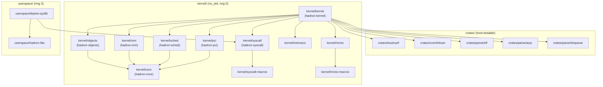

# Crate Structure

Hadron is organized as a Cargo workspace with three top-level directories: `crates/` (reusable, host-testable libraries), `kernel/` (ring-0 kernel crates), and `userspace/` (ring-3 system programs and libraries). The build system is `gluon`, a custom Rhai-scripted build tool wrapping Cargo and QEMU.

## Directory Layout

```
hadron/
├── crates/
│   ├── boot/
│   │   └── uefi/              # UEFI type bindings and boot stub
│   ├── core/
│   │   └── linkset/           # Linker-section data access macros
│   └── parse/
│       ├── acpi/              # ACPI table parser (RSDP, MADT, DMAR, ...)
│       ├── binparse/          # Binary structure parsing primitives
│       ├── binparse-macros/   # Proc macros for binparse
│       ├── dwarf/             # DWARF debug info parser
│       ├── elf/               # ELF64 parser (headers, PT_LOAD segments)
│       └── fdt/               # Flattened Device Tree parser
├── kernel/
│   ├── core/                  # hadron-core: addr types, sync, lockdep, cpu_local
│   ├── intrinsics/            # SIMD/SSE2/AVX intrinsic wrappers
│   ├── kernel/                # hadron-kernel: main kernel crate
│   ├── mm/                    # PMM, page table mapper, AddressSpace
│   ├── mmio/                  # Typed MMIO register block macros
│   ├── mmio-macros/           # Proc macro crate for mmio register_block!
│   ├── objects/               # Kernel object system (KernelObject, Handle, ...)
│   ├── pci/                   # PCI bus enumeration and capability parsing
│   ├── sched/                 # Per-CPU async executor and task scheduler
│   ├── syscall/               # Syscall definitions (numbers, errors, structs)
│   └── syscall-macros/        # Proc macro: define_syscalls!
└── userspace/
    ├── hadron-libc/           # C runtime and libc types for userspace
    ├── lepton-syslib/         # Native Rust syscall wrapper library
    └── (planned)
        ├── userboot/          # First userspace process
        ├── devmgr/            # Device manager
        ├── driver-host/       # Driver isolation host
        ├── servers/           # System servers (ramfs, fatfs, netstack, tty)
        └── drivers/           # Userspace hardware drivers
```

## Crates Directory (`crates/`)

These crates are host-testable — they have no `no_std` requirement forced by kernel context and can be compiled and tested on the development host without any kernel target.

### `crates/boot/uefi` — UEFI Bindings

Type-safe Rust bindings for the UEFI specification. Provides `#[repr(C)]` FFI types matching the UEFI ABI layout and safe wrapper methods for common firmware services (memory map, file access, GOP framebuffer, loaded image protocol).

Used by the kernel's UEFI boot path to interact with firmware before the kernel takes ownership of the machine. Not used after the kernel has exited UEFI boot services.

Status: adapted from a vendored dependency into a first-party crate.

### `crates/core/linkset` — Linker Section Utilities

Macros for safely accessing typed data placed in custom linker sections:

- `declare_linkset!` — generates a function returning `&'static [T]` from a pair of `__section_start` / `__section_end` linker symbols.
- `linkset_entry!` — places a typed static into a named linker section.
- `declare_linkset_blob!` — returns a raw `&'static [u8]` from a section.

Used by the kernel to implement plugin-style registration (e.g., driver probing tables, test case registration) without runtime allocation.

### `crates/parse/acpi` — ACPI Table Parser

A `no_std` parser for ACPI tables needed during early boot: RSDP, RSDT/XSDT, MADT (interrupt routing), HPET, FADT, MCFG (PCIe ECAM), SRAT/SLIT (NUMA topology), DMAR (IOMMU VT-d), and DSDT/SSDT AML namespace walking.

Physical memory access is abstracted via an `AcpiHandler` trait so the parser can be used both in the kernel (where physical addresses must be mapped first) and in userspace tools.

### `crates/parse/elf` — ELF64 Parser

A minimal, allocation-free ELF64 parser. Parses ELF headers and `PT_LOAD` program headers from a `&[u8]` slice. No unsafe code. Used by `userboot` to load the initial userspace binaries from the initrd.

### `crates/parse/binparse`, `binparse-macros` — Binary Structure Parsing

A derive-macro-based framework for parsing binary structures from byte slices. Similar in spirit to `zerocopy` but tailored to Hadron's needs (big/little endian annotations, optional bounds checking).

### `crates/parse/dwarf` — DWARF Parser

Parses DWARF debug information for kernel stack unwinding and panic backtraces. Used in debug builds only.

### `crates/parse/fdt` — Flattened Device Tree

Parser for the FDT (Device Tree Blob) format. Primarily used for potential ARM port support and for parsing QEMU-provided device trees in test environments.

## Kernel Directory (`kernel/`)

These crates target `x86_64-unknown-none` (or a custom kernel target). Most are `#![no_std]` and depend on the `alloc` crate via the kernel's global allocator.

### `kernel/core` — hadron-core

The foundational kernel support library. Contains everything that needs to be used by multiple kernel crates and can benefit from host-side testing:

- **`addr`**: `PhysAddr`, `VirtAddr` newtype wrappers with alignment helpers, `PhysFrame<S>`, `Page<S>`, `PageSize` trait.
- **`sync`**: `SpinLock<T>`, `IrqSpinLock<T>` (disables interrupts while held), `RwLock<T>`, `WaitQueue`, `OnceLock<T>`.
- **`lockdep`**: Compile-time lock ordering enforcement. Each lock type carries a level; acquiring a lock at level N while holding one at level >= N is a compile error.
- **`cpu_local`**: `CpuLocal<T>` — per-CPU storage backed by the `GS` base register.
- **`paging`**: Page table entry types, flag definitions, walker traits.

This crate has extensive host-side tests via `cargo test`, loom (concurrency tests), and miri (memory model tests).

### `kernel/intrinsics` — SIMD Intrinsics

Thin `#[inline(always)]` wrappers around SSE2/AVX inline assembly. All unsafe; callers must:
1. Verify CPU feature support via CPUID.
2. Hold a `KernelFpuGuard` (FPU state saved, interrupts disabled).

Used by the kernel for optimized memory operations (SIMD memcpy, zeroing) when context makes it safe.

### `kernel/mm` — Memory Management

Physical and virtual memory management:

- **`pmm`**: Physical Memory Manager — zone-based buddy allocator for physical frames. Zones are populated from the UEFI memory map at boot.
- **`mapper`**: Page table mapper — walks and modifies the four-level x86_64 page table. Allocates intermediate tables from the PMM.
- **`address_space`**: `AddressSpace` — wraps a page table root (CR3 value) with `map`, `unmap`, and `protect` operations.
- **`vmm`**: Virtual memory manager — implements the kernel-side of VMO page fault handling, COW fault resolution, and pager request dispatch.
- **`hhdm`**: Higher-half direct map utilities — converts physical addresses to kernel virtual addresses via the HHDM region.
- **`heap`**: Kernel heap setup using `linked_list_allocator` or a slab allocator (TBD).
- **`layout`**: Kernel virtual address space layout constants.
- **`zone`**, **`region`**: PMM zone and region abstractions.

### `kernel/objects` — Kernel Object System

The heart of the microkernel. Implements all kernel object types:

- **`object`**: `KernelObject` trait, `Koid`, `ObjectType`, `Signals` bitflags.
- **`handle`**: `HandleValue`, `Rights` bitflags, `HandleEntry`, `HandleTable`.
- **`process`**: `Process` object (address space + handle table + thread group).
- **`thread`**: `Thread` object and `ThreadState` enum.
- **`vmo`**: `Vmo` object and `VmoKind` (Paged, Cow, Pager, Contiguous).
- **`vmar`**: `Vmar` object, `VmarFlags`, `VmarMapping`, `VmarChild`.

Planned additions (Phase 2): Channel, Socket, Port, Event, EventPair, Timer, Fifo, Resource, Job, Interrupt, Iommu, Bti, Pmt.

This crate is `no_std` but has comprehensive host-side unit tests (`cargo test`).

### `kernel/pci` — PCI Enumeration

Portable PCI logic:

- Device enumeration algorithm (bus/device/function iteration).
- Configuration space register definitions.
- Capability linked-list walking (MSI, MSI-X, PCIe extended capabilities).
- VirtIO transport capability parsing.
- Class/subclass name lookup for debug output.

Hardware access is abstracted via the `PciConfigAccess` trait. The kernel crate provides concrete implementations: legacy CAM (I/O port access) and ECAM (MMIO mapped from MCFG ACPI table).

### `kernel/sched` — Scheduler and Executor

Per-CPU async executor providing the scheduling substrate:

- **`executor`**: `PerCpuExecutor` — runs kernel tasks as cooperative Rust futures. Each CPU runs its own executor. Work stealing between CPUs is triggered when a CPU's local queue is empty.
- **`primitives`**: Async-aware synchronization (async mutexes, async wait queues) used by blocking syscalls.
- **`timer`**: Timer wheel implementation — manages deadline-ordered timer expiry, drives `Timer` objects.
- **`waker`**: Custom `Waker` implementation that inserts the woken task back into the appropriate CPU's run queue.

Threads map to tasks in this executor: `thread_start` spawns an async task; blocking syscalls await the corresponding future; `thread_exit` completes the future.

### `kernel/syscall` — Syscall Definitions

The single source of truth for the Hadron syscall ABI. Uses the `define_syscalls!` proc macro to generate from a single declaration:

- `SYS_*` number constants.
- `E*` error code constants.
- `#[repr(C)]` data structures shared between kernel and userspace.
- `Syscall` and `SyscallGroup` enums.
- With feature `kernel`: `SyscallHandler` trait and `dispatch()` function.
- With feature `userspace`: raw `syscallN` asm stubs and typed wrapper functions.

Both the kernel and `lepton-syslib` depend on this crate with their respective features. This ensures the kernel and userspace can never diverge on syscall numbers or struct layouts.

### `kernel/syscall-macros` — Syscall Proc Macro

The `define_syscalls!` proc macro implementation. A separate crate because proc macros must be compiled as `proc-macro` crate type for the host, separate from the target being compiled for.

### `kernel/mmio`, `kernel/mmio-macros` — MMIO Register Abstractions

`register_block!` macro generates typed MMIO register accessor structs. All `unsafe` volatile reads/writes are consolidated into the struct's `new(ptr)` constructor; individual register access methods are safe.

Used by hardware driver code in the kernel to access device MMIO bars.

### `kernel/kernel` — Main Kernel Crate (hadron-kernel)

The top-level kernel binary crate. Depends on and integrates all other kernel crates:

- **`arch/`**: x86_64-specific code: GDT, IDT, interrupt handler stubs, syscall entry (`SYSCALL`/`SYSRET`), `UserRegisters` save/restore, `enter_userspace`/`iretq`, CPUID, MSR access, APIC, IOMMU (VT-d) programming.
- Boot entry point: receives the UEFI boot information structure and initializes all subsystems in order.
- Kernel panic handler and unwinding.
- Global allocator setup.
- SMP bringup (AP startup via INIT-SIPI-SIPI).

## Userspace Directory (`userspace/`)

### `userspace/hadron-libc` — C Runtime Core

Provides C runtime types (`size_t`, `ssize_t`, `pid_t`, etc.) and the minimal C ABI glue needed by Rust programs that link against libc-dependent crates. Separated into a `core/` sub-crate containing only `no_std`-compatible types.

### `userspace/lepton-syslib` — Native Syscall Library

The native Rust userspace library for Hadron programs that do not use a POSIX compatibility layer:

- Re-exports `hadron-syscall` (the syscall crate with the `userspace` feature).
- Provides `print!`/`println!` backed by the `debug_log` syscall or a tty channel.
- Provides a userspace heap allocator (linked list or slab, backed by `vmar_map`/`vmo_create`).
- Provides the `_start` entry point (sets up the stack, calls `userboot_main` or `main`).
- Provides `env::bootstrap_channel()` to retrieve the initial bootstrap channel handle.

Programs linking `lepton-syslib` do not need libc. This is the preferred dependency for system servers and drivers written in Rust.

### Planned Userspace Components

These components are specified but not yet implemented:

| Component | Description |
|-----------|-------------|
| `userboot` | First userspace process, launched directly by the kernel. Loads the initial process set from the initrd, creates the root job tree, hands off to `devmgr`. |
| `devmgr` | Device manager. Enumerates PCI devices via a resource handle, spawns driver hosts, maintains the device namespace. |
| `driver-host` | Isolation container for hardware drivers. Each driver runs in a `driver-host` process with a BTI handle for DMA access. |
| `servers/ramfs` | In-memory filesystem server. Serves the initial namespace before persistent storage is available. |
| `servers/fatfs` | FAT32 filesystem server for reading the EFI system partition. |
| `servers/netstack` | TCP/IP network stack. |
| `servers/tty` | Terminal multiplexer server. |
| `servers/compositor` | Display compositor for graphical output. |
| `drivers/` | Per-device userspace driver servers (virtio-net, virtio-blk, xhci, etc.). |

## Dependency Graph



## Legacy vs. New Crates

| Crate | Status | Notes |
|-------|--------|-------|
| `kernel/core` | Adapted | Extracted and expanded from legacy kernel; lockdep is new |
| `kernel/mm` | Adapted | PMM and mapper carried forward; VMO/VMAR are new |
| `kernel/sched` | New | Legacy had a simpler per-CPU loop; async executor is new |
| `kernel/objects` | New | Entire object system is new in the rewrite |
| `kernel/pci` | Carried forward | Minimal changes |
| `kernel/syscall` | New | Replaces ad-hoc syscall stubs with generated ABI |
| `kernel/intrinsics` | Carried forward | Unchanged |
| `kernel/mmio` | Carried forward | Unchanged |
| `crates/boot/uefi` | Replaced | Replaces Limine boot; UEFI is now the only boot path |
| `crates/parse/elf` | Carried forward | Now used by userboot, not kernel directly |
| `crates/parse/acpi` | Carried forward | Expanded with DMAR support for IOMMU |
| `userspace/lepton-syslib` | New | Was `lepton-wayland`; extracted and generalized |
| `userspace/hadron-libc` | New | Fresh; provides C ABI compatibility types |
