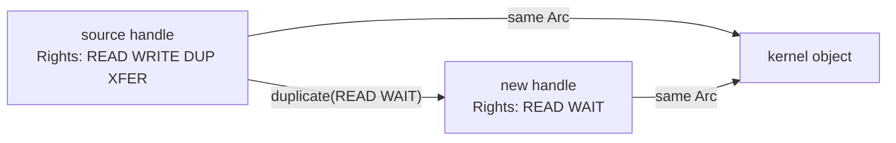
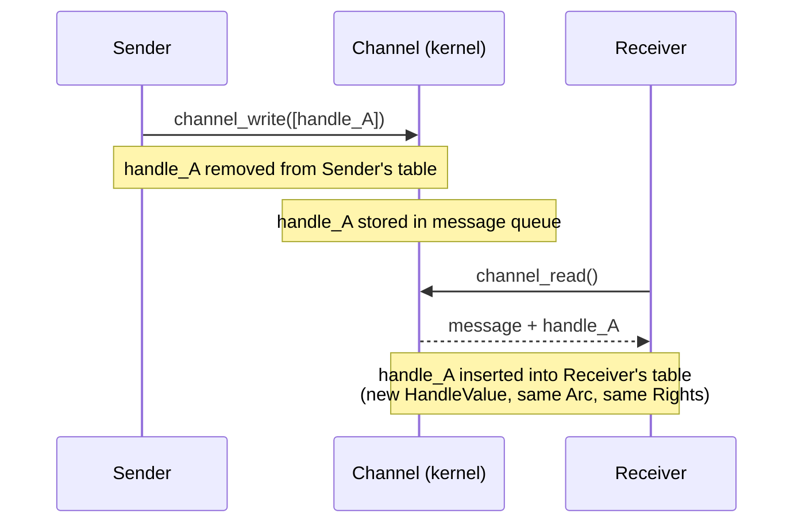
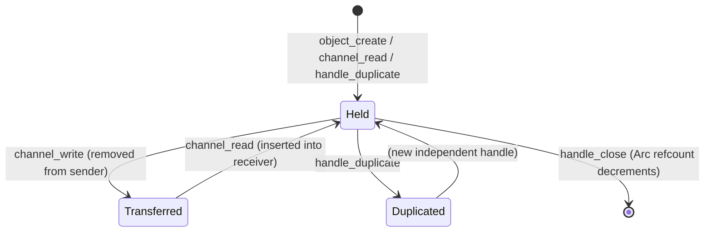

# Handle System

Handles are the sole mechanism by which userspace accesses kernel objects. This chapter covers the `HandleValue` type, the `Rights` bitflags, the `HandleEntry` record, the `HandleTable` that lives in each process, and the operations the table supports.

## HandleValue

A `HandleValue` is an opaque `u32` that names a handle within a single process:

```rust
#[repr(transparent)]
pub struct HandleValue(u32);

impl HandleValue {
    pub const INVALID: Self = Self(0);
}
```

`HandleValue` is **process-local**: the integer `42` in one process refers to an entirely different (or nonexistent) object than `42` in another process. The value has no meaning outside the process that owns it.

`HandleValue::INVALID` (zero) is the null sentinel. It is never assigned to a real handle. Syscalls that accept a handle value treat zero as "no handle" and return an appropriate error.

## Rights

Rights are a bitmask on each handle that restricts which operations the holder may perform on the underlying object:

```rust
bitflags! {
    pub struct Rights: u32 {
        const READ           = 1 << 0;
        const WRITE          = 1 << 1;
        const EXECUTE        = 1 << 2;
        const MAP            = 1 << 3;
        const DUPLICATE      = 1 << 4;
        const TRANSFER       = 1 << 5;
        const SIGNAL         = 1 << 6;
        const WAIT           = 1 << 7;
        const MANAGE_PROCESS = 1 << 8;
        const MANAGE_THREAD  = 1 << 9;
        const ENUMERATE      = 1 << 10;
        const SET_POLICY     = 1 << 11;
    }
}
```

### Right Semantics

| Right | Grants |
|-------|--------|
| `READ` | Read data from the object: receive messages from a channel, read bytes from a socket or VMO |
| `WRITE` | Write data to the object: send messages to a channel, write bytes to a socket or VMO |
| `EXECUTE` | Map VMO pages with execute permission into an address space |
| `MAP` | Map a VMO into a VMAR (requires this right on the VMO handle) |
| `DUPLICATE` | Call `handle_duplicate` to create an additional handle to the same object |
| `TRANSFER` | Send this handle over a channel to another process |
| `SIGNAL` | Raise or clear user-visible signals on the object (e.g., `object_signal`) |
| `WAIT` | Wait for signals on the object directly or via `object_wait_async` |
| `MANAGE_PROCESS` | Start or kill a process (`process_start`, `process_kill`) |
| `MANAGE_THREAD` | Start, suspend, kill, or read/write the register state of a thread |
| `ENUMERATE` | List the children of a job or the threads of a process |
| `SET_POLICY` | Set resource limits and policy on a job |

### Rights Monotonicity Invariant

**Rights can only be reduced, never amplified.** This is a fundamental security invariant enforced by the kernel at every operation boundary:

- `handle_duplicate(handle, new_rights)` requires that `new_rights` is a subset of the source handle's current rights. Any attempt to include a right not present on the source handle returns `AccessDenied`.
- The `DUPLICATE` right itself must be present on the source handle before a duplicate can be created at all.
- Transferred handles arrive in the receiver's handle table with exactly the rights they had in the sender's table (minus `TRANSFER` if the kernel strips it).

There is no privilege escalation path. A process can never obtain more rights on an object than the handle it was given at creation or transfer time.

### Predefined Rights Sets

Three composite sets cover the most common cases:

**`Rights::ALL`** — all twelve rights. Used when creating an object and returning the initial handle to the creator, who should have full control.

```rust
const ALL = READ | WRITE | EXECUTE | MAP | DUPLICATE | TRANSFER
          | SIGNAL | WAIT | MANAGE_PROCESS | MANAGE_THREAD
          | ENUMERATE | SET_POLICY;
```

**`Rights::CHANNEL_DEFAULT`** — the standard rights set for a channel endpoint:

```rust
const CHANNEL_DEFAULT = READ | WRITE | DUPLICATE | TRANSFER | SIGNAL | WAIT;
```

Note the absence of `MAP`, `EXECUTE`, `MANAGE_PROCESS`, etc. — these have no meaning for channels and are excluded by default.

**`Rights::VMO_DEFAULT`** — the standard rights set for a newly created VMO:

```rust
const VMO_DEFAULT = READ | WRITE | MAP | DUPLICATE | TRANSFER | WAIT;
```

`EXECUTE` is intentionally excluded. A process that needs to execute code from a VMO must be explicitly granted a handle with `EXECUTE` set, enforcing W^X policies.

## HandleEntry

A `HandleEntry` pairs a kernel object reference with its rights:

```rust
pub struct HandleEntry {
    object: Arc<dyn KernelObject>,
    rights: Rights,
}
```

`HandleEntry` is an internal kernel type. Userspace never sees it directly; it interacts only with the `HandleValue` integer. The `Arc<dyn KernelObject>` inside is the strong reference that keeps the object alive for as long as this handle exists.

## HandleTable

Each process owns exactly one `HandleTable`. All handle operations in syscalls go through this table:

```rust
pub struct HandleTable {
    entries: BTreeMap<HandleValue, HandleEntry>,
    next_value: u32,
}
```

The table is protected by a `SpinLock` in the `Process` struct. The `BTreeMap` provides O(log n) lookup and ordered iteration (useful for debugging and introspection).

### Capacity Limit

```rust
const MAX_HANDLES: usize = 1 << 16;  // 65536
```

A process may hold at most 65,536 handles simultaneously. Attempting to insert a handle into a full table returns `HandleError::TableFull`. This limit prevents unbounded kernel memory consumption from handle leaks.

### Handle Value Allocation

Handle values are assigned from a monotonically increasing counter starting at 1. The counter wraps around on overflow (skipping zero). Values are **not reused** in the sense that a closed handle's value may eventually be reassigned to a new handle, but not until the counter has wrapped. In practice, 32-bit counter space makes this extremely unlikely during any single process lifetime.

### Operations

#### Insert

```
fn insert(&mut self, entry: HandleEntry) -> Result<HandleValue, HandleError>
```

Adds a new handle to the table and returns its `HandleValue`. Called when:
- A process creates a new object (e.g., `channel_create` inserts both endpoints).
- A process receives a handle over a channel (`channel_read`).
- A process duplicates a handle (`handle_duplicate`).

Fails with `TableFull` if the 64K limit is reached.

#### Remove

```
fn remove(&mut self, value: HandleValue) -> Result<HandleEntry, HandleError>
```

Removes and returns the entry. This is the `handle_close` operation. When the returned `HandleEntry` is dropped, the `Arc<dyn KernelObject>` reference count decrements. If this was the last reference to the object, the object is destroyed.

Fails with `NotFound` if the handle does not exist.

#### Get

```
fn get(&self, value: HandleValue) -> Result<&HandleEntry, HandleError>
```

Looks up an entry without consuming it. Used internally when a syscall needs to read an object's state without removing the handle.

#### Get With Rights Check

```
fn get_with_rights(&self, value: HandleValue, required: Rights)
    -> Result<&HandleEntry, HandleError>
```

The primary syscall-layer accessor. Every syscall that operates on a handle calls this, specifying the rights the operation requires. Returns `AccessDenied` if the handle's rights do not include all of `required`. This single function is the choke point that enforces the entire capability model.

#### Duplicate

```
fn duplicate(&mut self, value: HandleValue, new_rights: Rights)
    -> Result<HandleValue, HandleError>
```

Creates a second handle to the same underlying object with equal or reduced rights. The original handle is unchanged. Both handles are independent: closing one does not close the other.

Preconditions (all enforced, any violation returns `AccessDenied`):
1. The source handle must have `Rights::DUPLICATE`.
2. `new_rights` must be a subset of the source handle's rights.



## Handle Transfer via Channels

Handles can be transferred between processes by including them in a channel message. This is the mechanism for capability delegation:

1. The sender calls `channel_write(channel, message_bytes, [handle_a, handle_b, ...])`.
2. The kernel **removes** the listed handles from the sender's table (they are moved, not copied).
3. The handles are stored in the channel's message queue alongside the message bytes.
4. When the receiver calls `channel_read`, the kernel **inserts** the handles into the receiver's table, assigning new `HandleValue` integers.

The handles arrive in the receiver's table with the same rights they had in the sender's table. The sender no longer holds them. This is a move, not a copy, which preserves the principle that capability transfer is explicit and does not multiply capabilities.



A handle with `Rights::TRANSFER` set may be sent over a channel. Attempting to transfer a handle that lacks `TRANSFER` returns an error before the write completes.

## Handle Lifecycle Summary



A handle is "live" for exactly as long as it occupies a slot in some process's handle table. Kernel objects remain alive as long as any live handle (or internal kernel reference) holds an `Arc` to them.
