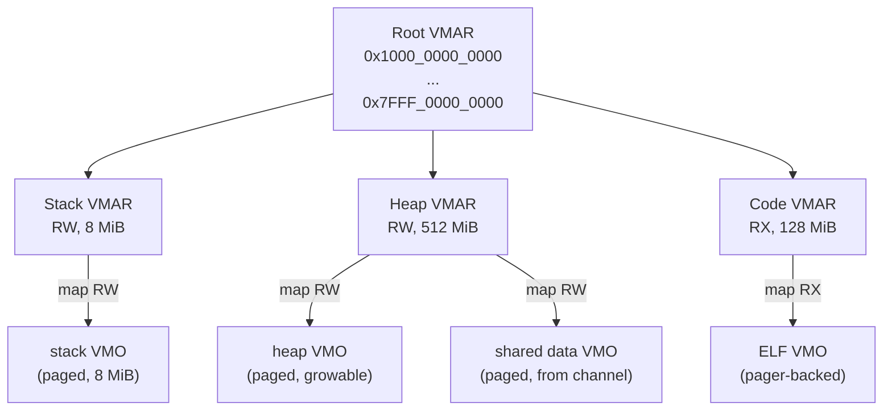
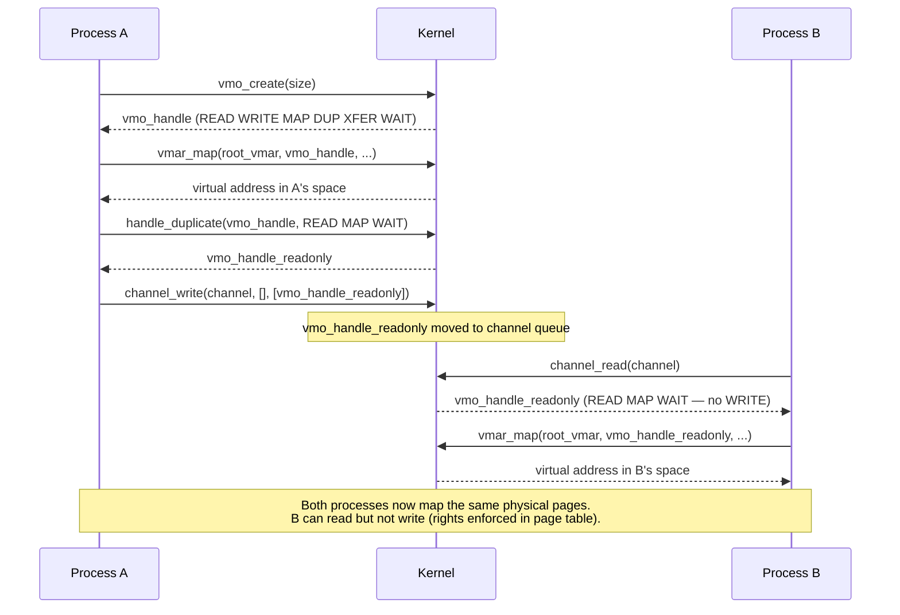
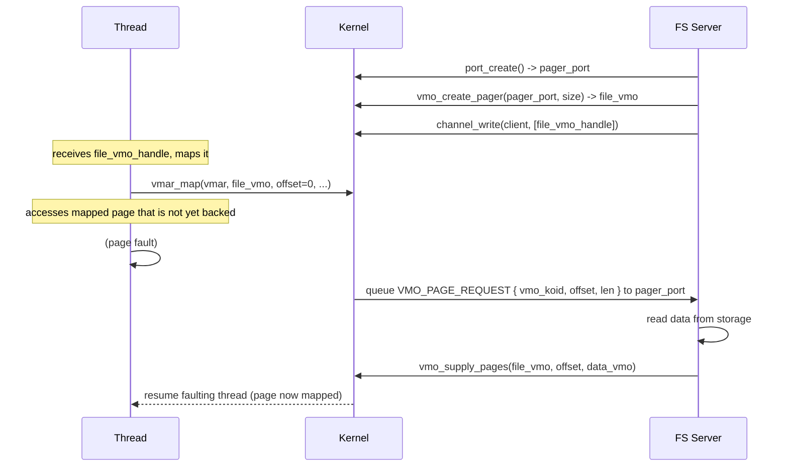

# Memory: VMO and VMAR

Hadron's memory model is built on two kernel object types: Virtual Memory Objects (VMOs) and Virtual Memory Address Regions (VMARs). Together they provide a structured, capability-controlled abstraction over physical memory and process address spaces.

## Virtual Memory Object (VMO)

A VMO is a container of physical pages, independent of any address space. VMOs can be:

- Read and written directly via syscalls (for small transfers).
- Mapped into one or more VMARs for zero-copy shared memory.
- Cloned with copy-on-write semantics.
- Backed by a userspace pager (for filesystem mmap).

A VMO has a size (always page-aligned), a koid, and a `VmoKind` that describes its backing store.

### VmoKind

```rust
pub enum VmoKind {
    Paged,
    Cow { parent: Arc<Vmo>, offset: u64 },
    Pager { port: Arc<dyn KernelObject> },
    Contiguous,
}
```

**`Paged`** — Standard anonymous VMO backed by committed physical pages. The most common kind. Pages are allocated on demand (demand paging) or pre-committed via `vmo_op_range(COMMIT)`.

**`Cow`** — Copy-on-write child of another VMO. Created with `vmo_create_child`. The child shares the parent's pages until either side writes to a shared page, at which point the kernel allocates a new physical page for the writer and copies the content. COW children:
- Reference the parent via `Arc<Vmo>`, keeping the parent alive.
- Track a byte `offset` into the parent's address space.
- Can themselves be cloned, forming a tree.

**`Pager`** — Port-backed VMO for userspace filesystem servers. When a thread faults on a page that has not been supplied, the kernel queues a `VMO_PAGE_REQUEST` packet to the pager's port. The pager server supplies the page content via `vmo_supply_pages`, and the kernel resumes the faulting thread. This is the mechanism for filesystem `mmap` and executable loading.

**`Contiguous`** — Pages allocated from physically contiguous memory. Required for DMA to devices that cannot scatter-gather. Not resizable. Created explicitly; the kernel must find a contiguous region in the PMM at creation time.

### VMO Operations

**`vmo_create(size) -> HandleValue`**

Creates a new paged VMO. Size is rounded up to the nearest page boundary (4 KiB). The caller receives `Rights::VMO_DEFAULT`.

**`vmo_create_contiguous(size) -> HandleValue`**

Creates a contiguous VMO. May fail with `NO_MEMORY` if no suitable contiguous region exists.

**`vmo_read(vmo: HandleValue, offset: u64, buf: &mut [u8]) -> Result<usize>`**

Required rights: `READ`. Copies VMO bytes into a userspace buffer. For large reads, mapping the VMO is more efficient.

**`vmo_write(vmo: HandleValue, offset: u64, data: &[u8]) -> Result<usize>`**

Required rights: `WRITE`. Copies userspace bytes into the VMO. Pages are committed as needed.

**`vmo_get_size(vmo: HandleValue) -> Result<u64>`**

Returns the current size.

**`vmo_set_size(vmo: HandleValue, new_size: u64) -> Result<()>`**

Required rights: `WRITE`. Only valid for `Paged` VMOs. Shrinking decommits the released pages; extending adds uncommitted space.

**`vmo_create_child(vmo: HandleValue, offset: u64, size: u64) -> Result<HandleValue>`**

Required rights: `READ` (and optionally `WRITE` for writable children). Creates a COW child. `offset` and `size` must be page-aligned.

**`vmo_op_range(vmo: HandleValue, op: VmoOp, offset: u64, len: u64) -> Result<()>`**

Performs a bulk operation on a range:
- `COMMIT` — pre-commit pages (avoid demand-paging faults).
- `DECOMMIT` — release pages back to the PMM (pages read again will be zero-filled).
- `LOCK` / `UNLOCK` — pin/unpin pages for DMA (via BTI; see IOMMU chapter).
- `CACHE_SYNC` — flush CPU caches for DMA coherency.

## Virtual Memory Address Region (VMAR)

A VMAR is a tree node in a process's address space. Every process starts with a root VMAR spanning the entire user address range. The tree structure enforces that no two children overlap.

```rust
pub struct Vmar {
    koid:     Koid,
    base:     u64,
    size:     u64,
    mappings: SpinLock<Vec<VmarMapping>>,
    children: SpinLock<Vec<VmarChild>>,
}
```

### VMAR Tree



### VmarFlags

Flags control both the permissions of the mapping and the placement policy:

| Flag | Meaning |
|------|---------|
| `READ` | Pages are readable |
| `WRITE` | Pages are writable |
| `EXECUTE` | Pages are executable |
| `SPECIFIC` | Place mapping at the given offset (not auto-assigned) |
| `SPECIFIC_OVERWRITE` | Allow overwriting existing mappings at the target range |
| `RW` | Shorthand: `READ \| WRITE` |
| `RX` | Shorthand: `READ \| EXECUTE` |

`WRITE` and `EXECUTE` are mutually exclusive in practice (W^X policy). The kernel enforces this when both flags are set without explicit override.

### VmarMapping

```rust
pub struct VmarMapping {
    vmo:        Arc<Vmo>,
    vmo_offset: u64,
    addr:       u64,
    len:        u64,
    flags:      VmarFlags,
}
```

A mapping associates a range of a VMO with a range of virtual addresses inside the VMAR. The virtual range `[addr, addr+len)` corresponds to VMO bytes `[vmo_offset, vmo_offset+len)`.

Multiple VMARs (across multiple processes) can map the same VMO simultaneously. All share the same physical pages (until a COW write).

### VMAR Operations

**`vmar_allocate(parent: HandleValue, offset: u64, size: u64, flags: VmarFlags) -> Result<HandleValue>`**

Required rights: `WRITE` (or a specific manage right, TBD in syscall layer). Carves out a sub-VMAR at the given offset within the parent. Returns an error if the range overlaps an existing child or mapping.

**`vmar_map(vmar: HandleValue, vmo: HandleValue, vmo_offset: u64, addr: u64, len: u64, flags: VmarFlags) -> Result<u64>`**

Required rights: `WRITE` on `vmar`; `MAP` on `vmo` (and `READ`/`WRITE`/`EXECUTE` matching the requested `flags`). Maps a VMO range into the VMAR. Returns the virtual address of the mapping. If `SPECIFIC` is not set, the kernel chooses a free address.

**`vmar_unmap(vmar: HandleValue, addr: u64, len: u64) -> Result<()>`**

Removes all mappings that overlap `[addr, addr+len)`. The underlying VMO is unaffected (its pages remain allocated). If the mapped VMO had no other mappings, it is not destroyed — that requires closing all handles to it.

**`vmar_protect(vmar: HandleValue, addr: u64, len: u64, flags: VmarFlags) -> Result<()>`**

Changes the permission flags of all mappings in `[addr, addr+len)`. Cannot grant permissions the original mapping did not have.

**`vmar_destroy(vmar: HandleValue) -> Result<()>`**

Unmaps all mappings and destroys all child VMARs recursively. Attempting to use a destroyed VMAR returns `DESTROYED`. The root VMAR cannot be explicitly destroyed (it is destroyed implicitly when the process exits).

### Overlap Detection

The VMAR allocator checks both the children list and the mappings list for any overlap with the requested range. Overlapping allocations always fail — there is no implicit merge or overwrite (unless `SPECIFIC_OVERWRITE` is set for a mapping).

```rust
// From vmar.rs: allocate checks existing children
for existing in children.iter() {
    let ex_base = self.base + existing.offset;
    let ex_end = ex_base + existing.vmar.size;
    if child_base < ex_end && child_end > ex_base {
        return Err(VmarError::Overlap);
    }
}
```

## Shared Memory Pattern

The standard pattern for establishing shared memory between two processes:



Process A controls the level of access it grants by choosing which rights to include when duplicating the handle before transfer.

## Pager-Backed VMOs

Pager VMOs enable userspace filesystem servers to serve page faults, making `mmap` and demand-paged executable loading possible without kernel filesystem code.

The flow for a filesystem-backed file:



The FS server never needs to eagerly read the entire file. Pages are fetched on demand. If the FS server crashes, subsequent page faults on its VMOs return `IO_ERROR` to the faulting threads — the kernel never trusts the pager to be correct.
