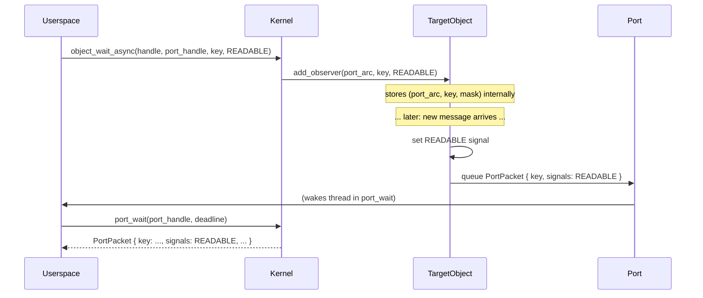

# Object Model

Every kernel resource in Hadron is a kernel object. This chapter describes the `KernelObject` trait that all objects implement, the identity system (`Koid`), the complete object type taxonomy, signals, and the observer pattern for asynchronous signal delivery.

## KernelObject Trait

The `KernelObject` trait is the single interface through which the kernel (and, indirectly, userspace via syscalls) interacts with any kernel resource:

```rust
pub trait KernelObject: Send + Sync + 'static {
    fn object_type(&self) -> ObjectType;
    fn koid(&self) -> Koid;
    fn related_koid(&self) -> Koid { Koid::INVALID }
    fn get_signals(&self) -> Signals;
    fn add_observer(&self, port: &Arc<dyn KernelObject>, key: u64, signals: Signals);
    fn remove_observer(&self, port: &Arc<dyn KernelObject>);
}
```

All kernel objects are stored as `Arc<dyn KernelObject>` and accessed through entries in a process's handle table. No raw object references are ever exposed to userspace.

### Method Semantics

**`object_type`** — Returns the `ObjectType` discriminant. Used by the syscall layer to verify that a handle refers to the expected object kind before dispatching type-specific operations.

**`koid`** — Returns the object's globally unique identifier. Koids are stable for the lifetime of an object and can be used to correlate objects across debug traces and introspection syscalls.

**`related_koid`** — Returns the koid of a logically related peer object. For channels and sockets, this is the koid of the other endpoint. For event pairs, it is the partner event. Objects with no peer return `Koid::INVALID`. This enables userspace to discover the other end of a paired object given only one handle.

**`get_signals`** — Returns the current signal bitmask. Signal state is always consistent: reads return a snapshot that was valid at the instant of the call. Signal transitions are not lost; each transition is delivered to registered port observers.

**`add_observer`** / **`remove_observer`** — Register and unregister a port as an observer for signal changes. When the observed signals become asserted, a `PortPacket` is queued to the port. See the [Observer Pattern](#observer-pattern) section below.

### Thread Safety Requirements

The `Send + Sync + 'static` bounds on `KernelObject` are not accidental. Objects may be referenced simultaneously from multiple CPUs (multiple threads in the same process, or multiple processes sharing a VMO). All state that can change after construction must be protected by appropriate synchronization — typically `SpinLock<T>` for structured state or `AtomicU32`/`AtomicU64` for signal and flag fields.

## Koid: Kernel Object Identifier

A `Koid` is a globally unique `u64` identifier assigned to each kernel object at creation time.

```rust
#[repr(transparent)]
pub struct Koid(u64);

static NEXT_KOID: AtomicU64 = AtomicU64::new(1);

impl Koid {
    pub const INVALID: Self = Self(0);

    pub fn alloc() -> Self {
        Self(NEXT_KOID.fetch_add(1, Ordering::Relaxed))
    }
}
```

Key properties:

- **Globally unique**: The counter is a single kernel-wide atomic. No two objects ever share a koid within a boot session.
- **Never reused**: Even after an object is destroyed, its koid is retired. The counter only moves forward.
- **Zero is reserved**: `Koid(0)` is `Koid::INVALID`, used wherever a "no related peer" sentinel is needed.
- **Allocation cost**: A single `fetch_add` on a relaxed atomic — no locks, no cache-line contention in typical workloads.

Koids appear in kernel debug output, in `PortPacket` payloads, and in introspection syscalls. They are the stable reference for correlating objects across different handle tables (e.g., identifying that a VMO received over a channel is the same object that was created by a particular process).

## ObjectType Enum

The `ObjectType` discriminant identifies the concrete type of a kernel object. It is a `u32` in the ABI so it passes cleanly across the syscall boundary.

| Variant | Value | Description |
|---------|-------|-------------|
| `None` | 0 | Sentinel; no valid object has this type |
| `Process` | 1 | Address space + handle table + thread group |
| `Thread` | 2 | Schedulable execution context |
| `Vmo` | 3 | Virtual Memory Object — physical page container |
| `Vmar` | 4 | Virtual Memory Address Region — address space tree node |
| `Channel` | 5 | Bidirectional message + handle passing IPC |
| `Socket` | 6 | Streaming byte IPC (like a socketpair) |
| `Port` | 7 | Async event aggregation (like epoll) |
| `Event` | 8 | One-shot signaling primitive |
| `EventPair` | 9 | Paired signaling primitive (linked pair) |
| `Timer` | 10 | Deadline-based timer, fires a signal at a point in time |
| `Fifo` | 11 | Fixed-size element queue for high-frequency small messages |
| `Resource` | 12 | Hierarchical capability tree node for hardware access |
| `Job` | 13 | Process group container with resource limits and policy |
| `Interrupt` | 14 | Hardware IRQ object |
| `Iommu` | 15 | IOMMU context (VT-d domain) |
| `Bti` | 16 | Bus Transaction Initiator — DMA grant token |
| `Pmt` | 17 | Pinned Memory Token — pinned VMO region for an in-flight DMA op |

The syscall layer uses `ObjectType` for pre-dispatch validation. A syscall that expects a `Channel` handle will check the type and return `ZX_ERR_WRONG_TYPE` (or Hadron's equivalent) before executing any type-specific logic.

## Signals

Signals are a bitmask of observable conditions on a kernel object. They are the mechanism by which kernel objects communicate state changes to waiting userspace threads.

```rust
bitflags! {
    pub struct Signals: u32 {
        // Object-specific bits (0–4)
        const SIGNAL_0 = 1 << 0;
        const SIGNAL_1 = 1 << 1;
        const SIGNAL_2 = 1 << 2;
        const SIGNAL_3 = 1 << 3;
        const SIGNAL_4 = 1 << 4;

        // Peer lifecycle (24–25)
        const PEER_CLOSED   = 1 << 24;
        const HANDLE_CLOSED = 1 << 25;

        // Convenience aliases
        const READABLE    = Self::SIGNAL_0.bits();  // channel/socket: data available
        const WRITABLE    = Self::SIGNAL_1.bits();  // channel/socket: peer can accept
        const TERMINATED  = Self::SIGNAL_0.bits();  // process/thread: has exited
    }
}
```

### Signal Semantics

Signals are **level-triggered**: a signal that is asserted remains asserted until the condition clears. A thread waiting for `READABLE` on a channel will not be woken spuriously; the signal stays high until the message queue is drained.

Signals are **monotonically observable**: transitions are never dropped. If a signal is asserted and then cleared before a waiting thread wakes, the transition was still delivered to any registered port observers at the moment it occurred.

### Object-Specific Signal Meanings

| Object type | SIGNAL_0 (READABLE / TERMINATED) | SIGNAL_1 (WRITABLE) | PEER_CLOSED |
|------------|----------------------------------|---------------------|-------------|
| Channel | Messages available to read | Peer can accept writes | Peer endpoint closed |
| Socket | Data available to read | Write buffer not full | Peer endpoint closed |
| Process | Process has terminated | — | — |
| Thread | Thread has terminated | — | — |
| EventPair | User-set signal | User-set signal | Peer event closed |
| Timer | Deadline has fired | — | — |
| Fifo | Elements available to read | Space available to write | — |

## Observer Pattern

The observer pattern connects signal-producing objects to Port objects, enabling efficient async notification without polling.

When userspace calls `object_wait_async(handle, port, key, signals)`:

1. The kernel calls `object.add_observer(port_arc, key, signals)` on the target object.
2. The object records the observer internally (typically in a `SpinLock<Vec<Observer>>` field).
3. Whenever the object's signal state changes and the new state intersects the observed `signals`, the object queues a `PortPacket` to the registered port.
4. The port wakes any thread blocked in `port_wait`.



Observer registration is idempotent per port: registering the same port twice on the same object replaces the previous registration rather than duplicating it.

When a handle is closed, the kernel calls `remove_observer` on the referenced object, preventing stale deliveries to a port that has itself been closed.

## Reference Counting and Object Lifetime

Objects are heap-allocated and wrapped in `Arc<dyn KernelObject>`. Reference counts track all living references:

- Each `HandleEntry` in any process's handle table holds one `Arc` strong reference.
- Peer objects (channel endpoints, event pairs) may hold `Weak` references to avoid reference cycles.
- Registered port observers hold `Arc` references to the port being notified.

An object is destroyed when its reference count reaches zero. Destruction triggers:
1. Signal delivery of `HANDLE_CLOSED` (if any observer registered for it).
2. For paired objects: assertion of `PEER_CLOSED` on the surviving peer.
3. Release of any held resources (physical pages for VMOs, etc.).

Because objects can be referenced by multiple handle tables simultaneously (e.g., a VMO held by two processes), the `Arc` reference count is the authoritative lifetime oracle. There is no explicit `close` operation that immediately destroys an object; removal from a handle table drops one `Arc`, and destruction occurs naturally when the count reaches zero.
