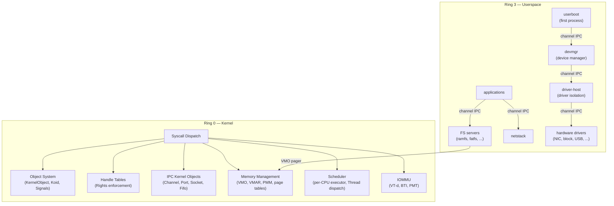
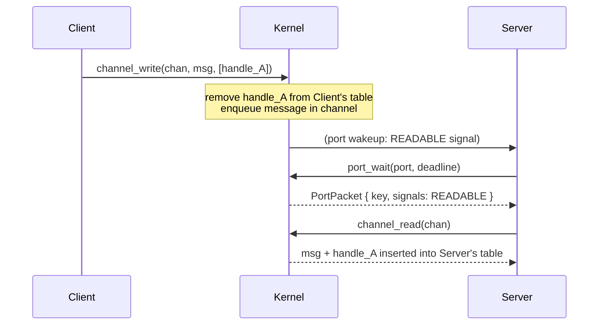

# Architecture Overview

This chapter describes the high-level structure of the Hadron kernel: what makes it a microkernel, what the kernel is responsible for, what runs in userspace, and how the pieces connect.

## What Makes It a Microkernel

A microkernel provides only the services that cannot be implemented safely in userspace. In Hadron, that means:

| Kernel responsibility | Rationale |
|----------------------|-----------|
| Object lifecycle and reference counting | Objects must outlive all handles; only the kernel can enforce this |
| Handle table and capability enforcement | Capability revocation must be unforgeable |
| Address space management (VMO/VMAR) | Page tables and physical frames require ring 0 |
| Scheduling and CPU dispatch | Context switches and IRQ delivery require ring 0 |
| IPC primitives | Synchronization across address space boundaries requires kernel mediation |
| IOMMU programming | DMA isolation requires ring 0 access to VT-d hardware |

Everything else is pushed to userspace:

| Userspace responsibility | Component |
|-------------------------|-----------|
| Device drivers | `driver-host` + per-driver servers |
| Device enumeration | `devmgr` (device manager) |
| Filesystems | `ramfs`, `fatfs`, and other FS servers |
| Networking | `netstack` server |
| Terminal / compositor | `tty`, `compositor` servers |
| First process setup | `userboot` |

## The Object Kernel Concept

Hadron follows an "object kernel" model: every kernel resource is a typed, reference-counted object. Objects are accessed only through handles. The kernel exports no raw pointers, no shared memory regions, no implicit globals visible to userspace.

This has several consequences:

- **Uniformity**: The same mechanisms — handle tables, rights checks, signal observation, port delivery — work identically for channels, processes, memory regions, hardware interrupts, and everything else.
- **Auditability**: Given a process's handle table, you can enumerate exactly what resources it holds and with what rights.
- **Composability**: Handles can be duplicated (with equal or reduced rights) and transferred between processes over channels, enabling fine-grained privilege delegation without kernel involvement.

## Kernel vs. Userspace Boundary

## How Everything Connects

The interaction pattern is always the same regardless of which pair of components is communicating:

1. A client holds a handle to a channel endpoint with appropriate rights.
2. The client calls `channel_write` to send a message (bytes + optional handles).
3. The kernel copies the message into the channel's internal queue and signals the peer endpoint.
4. The server is woken (via a Port it is waiting on) and calls `channel_read` to receive the message.
5. Any handles transferred in the message are atomically moved from the sender's handle table to the receiver's handle table.

## Comparison with the Legacy Framekernel

The original Hadron was a monolithic framekernel. The table below summarizes the key differences:

| Aspect | Legacy framekernel | Object microkernel |
|--------|-------------------|-------------------|
| Driver boundary | None (drivers in kernel binary) | Process boundary (driver-host) |
| DMA isolation | None | IOMMU / BTI / PMT |
| Resource access model | Rust ownership (compile-time) | Handle table + rights (runtime) |
| Filesystem dispatch | Internal kernel VFS | Channel IPC to FS servers |
| Privilege granularity | Ring 0 / Ring 3 | Per-handle rights mask |
| Capability transfer | Not possible | Handle transfer via channels |
| Fault containment | Driver bug can panic kernel | Driver crash is process crash |

The object microkernel design accepts a performance cost for IPC that the monolithic kernel avoids for in-kernel subsystem calls. This cost is mitigated by batching, shared-memory VMOs for bulk data, and the FIFO object type for high-frequency small messages.
