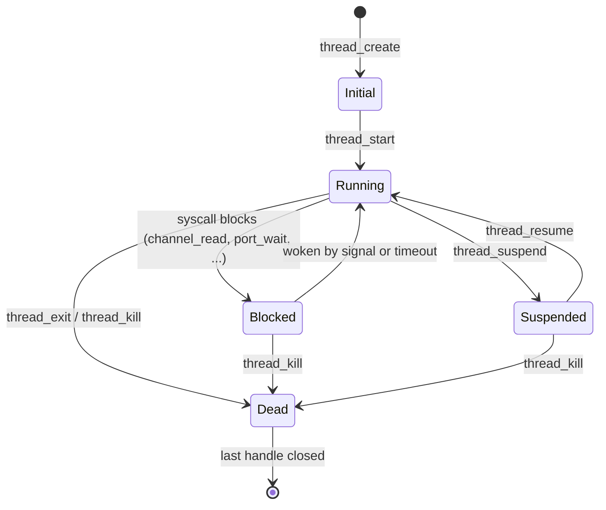
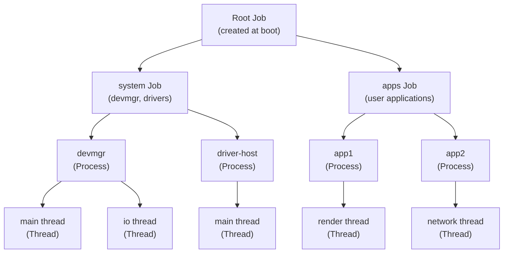

# Process and Thread Model

Hadron's process and thread model follows the object kernel principle: processes and threads are kernel objects accessed through handles. There are no implicit process-global resources like file descriptor tables or current working directories — handles replace file descriptors, and capability-controlled namespace objects replace the VFS current working directory.

## Process

A process is the fundamental isolation boundary. It provides:

- A virtual address space (root VMAR).
- A handle table for all kernel object references.
- A group of threads that share the address space.
- A parent Job for resource accounting and policy enforcement.

### Process Structure

```rust
pub struct Process {
    koid:         Koid,
    name:         SpinLock<String>,
    handle_table: SpinLock<HandleTable>,
    root_vmar:    Arc<Vmar>,
    threads:      SpinLock<Vec<Arc<Thread>>>,
    job:          SpinLock<Option<Weak<dyn KernelObject>>>,
    return_code:  AtomicI64,
    signals:      AtomicU32,
}
```

The `name` field is a human-readable string used in debug output and kernel introspection. It has no security significance.

There is no file descriptor table (`fd_table`) and no current working directory (`cwd`). Applications that need file access obtain it through handles to channel endpoints connected to filesystem servers. This is a deliberate design choice: the kernel does not need to understand POSIX VFS semantics, and the same handle mechanism used for IPC also provides all necessary file-like operations.

### Process Signals

| Signal | Meaning |
|--------|---------|
| `TERMINATED` (SIGNAL_0) | The process has called `process_exit` or been killed |

After `TERMINATED` is asserted, `return_code()` yields the exit code. The process object remains alive (and its koid remains valid) as long as any handle to it exists.

### Process Operations

**`process_create(job: HandleValue, name: &str) -> Result<(HandleValue, HandleValue)>`**

Creates a new process in the given job. Returns a handle to the new process and a handle to its root VMAR. Required rights on `job`: `MANAGE_PROCESS`.

The new process starts with:
- An empty handle table.
- A root VMAR spanning the full user address range.
- No threads.

**`process_start(process: HandleValue, thread: HandleValue, entry: u64, stack: u64, arg1: HandleValue, arg2: u64) -> Result<()>`**

Required rights on `process`: `MANAGE_PROCESS`; on `thread`: `MANAGE_THREAD`.

Starts the first thread of a process. `entry` is the virtual address of the entry point. `stack` is the initial stack pointer. `arg1` is a handle transferred into the new process (typically the bootstrap channel). `arg2` is a raw integer passed in a register.

`process_start` can only be called once per process.

**`process_exit(code: i64) -> !`**

Terminates the calling process with the given exit code. All threads are killed, all handles are closed, and the `TERMINATED` signal is asserted on the process object. The process object itself is not destroyed until all handles to it are closed.

**`process_kill(process: HandleValue) -> Result<()>`**

Required rights: `MANAGE_PROCESS`. Kills a process unconditionally. Equivalent to calling `process_exit` from outside the process.

## Thread

A thread is a schedulable execution context that belongs to a process. Threads share the address space and handle table of their parent process but have independent register state, kernel stacks, and execution state.

### Thread Structure

```rust
pub struct Thread {
    koid:    Koid,
    name:    SpinLock<String>,
    process: Weak<Process>,
    state:   SpinLock<ThreadState>,
    signals: AtomicU32,
}
```

The `process` reference is `Weak` to avoid a reference cycle (Process holds `Arc<Thread>`, Thread holds `Weak<Process>`). A thread can always upgrade the `Weak` to `Arc` while it is alive, since the process's `Arc<Thread>` in the threads list keeps the process alive indirectly.

### ThreadState

```rust
pub enum ThreadState {
    Initial,    // created, not yet started
    Running,    // running or runnable
    Suspended,  // paused, not runnable until resumed
    Blocked,    // waiting on a kernel object
    Dead,       // exited
}
```

State transitions:



### Thread and the Async Executor

Each thread maps to a task on Hadron's per-CPU async executor. When a thread blocks in a syscall, the executor parks the corresponding future and schedules another task. When the blocking condition resolves (a message arrives, a signal fires, a deadline passes), the future is resumed.

This mapping allows the kernel to be written in an async style without dedicating a kernel stack to every blocked thread. The user-visible register state (saved on syscall entry via `UserRegisters`) is stored separately from the executor's Rust future stack frames.

### Thread Signals

| Signal | Meaning |
|--------|---------|
| `TERMINATED` (SIGNAL_0) | The thread has exited (called `thread_exit` or was killed) |

### Thread Operations

**`thread_create(process: HandleValue, name: &str) -> Result<HandleValue>`**

Required rights on `process`: `MANAGE_THREAD`. Creates a new thread in the initial state. The thread does not start executing until `thread_start` is called.

**`thread_start(thread: HandleValue, entry: u64, stack: u64, arg1: u64, arg2: u64) -> Result<()>`**

Required rights: `MANAGE_THREAD`. Starts the thread at `entry` with the given stack pointer and two arguments. Transitions the thread from `Initial` to `Running`.

**`thread_exit(code: i64) -> !`**

Terminates the calling thread. Sets state to `Dead` and asserts `TERMINATED`.

**`thread_kill(thread: HandleValue) -> Result<()>`**

Required rights: `MANAGE_THREAD`. Kills a thread from outside. The thread is transitioned to `Dead` at the next safe preemption point.

**`thread_suspend(thread: HandleValue) -> Result<()>`**

Required rights: `MANAGE_THREAD`. Suspends the thread. The thread remains suspended until `thread_resume` is called.

**`thread_read_state(thread: HandleValue, kind: StateKind, buf: &mut [u8]) -> Result<()>`**

Required rights: `MANAGE_THREAD`. Reads the thread's register state. The thread must be suspended or dead. `StateKind::GeneralRegs` reads the `UserRegisters` struct (all general-purpose registers plus RFLAGS and RIP).

**`thread_write_state(thread: HandleValue, kind: StateKind, buf: &[u8]) -> Result<()>`**

Required rights: `MANAGE_THREAD`. Writes the thread's register state. Used by debuggers and fault handlers.

## Job Hierarchy

Jobs form a tree. Every process is a member of exactly one job. Jobs provide:

- **Resource accounting**: track total memory and handle usage across all descendant processes.
- **Policy enforcement**: limit what syscalls descendant processes may perform.
- **Kill propagation**: killing a job kills all descendant jobs and processes.



The root job is created at boot by `userboot`. All other jobs descend from it. A handle to the root job effectively gives the holder the ability to control the entire system — it is kept only by the most privileged system components.

### Job Resource Limits

Jobs can be configured with limits:

| Limit | Description |
|-------|-------------|
| `max_processes` | Maximum number of processes in this job subtree |
| `max_threads` | Maximum number of threads in this job subtree |
| `max_handles` | Maximum total handles across all processes in subtree |
| `max_memory_bytes` | Maximum physical memory committed by processes in subtree |

Exceeding a limit causes the relevant create operation to fail, rather than silently allowing resource exhaustion.

### Job Policy

Jobs can restrict which syscalls and operations their descendant processes may perform. Policies are inherited: a child job cannot have a policy more permissive than its parent. Policy violations either fail the syscall or kill the violating process, depending on the policy configuration.

### Kill Propagation

Calling `job_kill(job)` traverses the entire subtree rooted at that job, killing all processes (which kills all their threads), then destroying all child jobs. Kill propagation is depth-first and synchronous from the kernel's perspective: by the time `job_kill` returns, all processes in the subtree are in the `TERMINATED` state.

### Job Operations

**`job_create(parent: HandleValue, options: u32) -> Result<HandleValue>`**

Required rights on `parent`: `MANAGE_PROCESS` (or a dedicated `MANAGE_JOB` right, TBD). Creates a child job.

**`job_set_policy(job: HandleValue, policy: &[PolicyEntry]) -> Result<()>`**

Required rights: `SET_POLICY`. Configures the job's policy. Policies are specified as a list of `(condition, action)` pairs.

**`job_kill(job: HandleValue) -> Result<()>`**

Required rights: `MANAGE_PROCESS`. Kills the entire job subtree.
