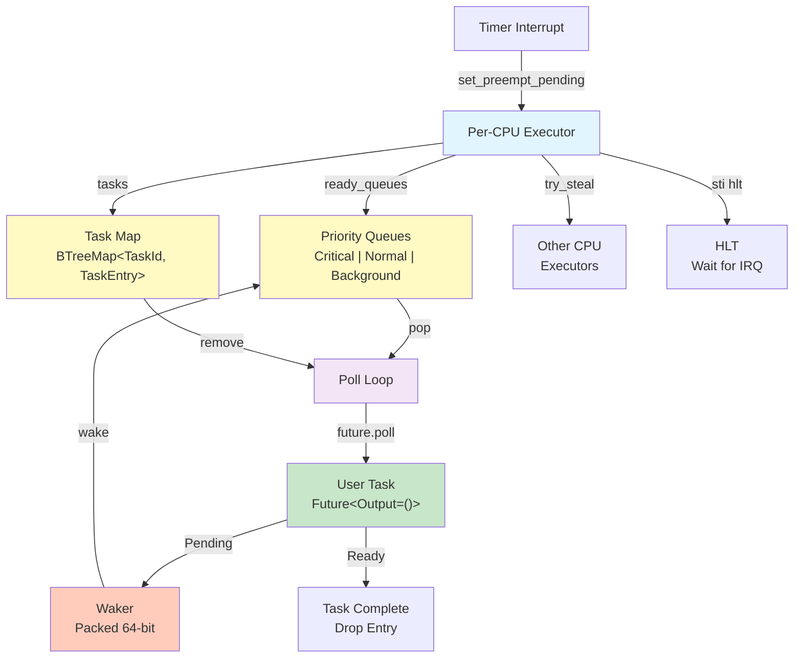

# Task Execution & Scheduling

Hadron models each user process as an async task on the kernel's cooperative executor. Instead of a traditional preemptive thread scheduler, all kernel work runs as `Future<Output = ()> + Send + 'static` tasks that yield at `.await` points. Each CPU runs its own executor instance with three strict priority tiers, and processes are driven by an async event loop that handles syscalls, preemption, and I/O through a trap-and-longjmp mechanism.

The implementation lives under `kernel/kernel/src/sched/` (executor), `kernel/kernel/src/task.rs` (task types), and `kernel/kernel/src/proc/` (process management).

## Async Executor Architecture

Source: [`kernel/kernel/src/sched/executor.rs`](https://github.com/anomalyco/hadron/blob/main/kernel/kernel/src/sched/executor.rs)

Hadron uses a cooperative async executor as its core scheduling mechanism. Each CPU's `Executor` owns the per-CPU task storage, ready queues organized by priority, and the main polling loop.

### Priority Tiers

The `Priority` enum defines three tiers, represented as `#[repr(u8)]`:

```rust
pub enum Priority {
    Critical   = 0,  // Interrupt bottom-halves, hardware event completion
    Normal     = 1,  // Kernel services and device drivers
    Background = 2,  // Housekeeping: memory compaction, log flushing, statistics
}
```

The `ReadyQueues` struct maintains one `VecDeque<TaskId>` per priority tier. The `pop()` method enforces strict ordering:

1. **Critical always first.** If the Critical queue is non-empty, it is drained before any other tier runs. Popping a Critical task resets the Normal streak counter.

2. **Normal next, with starvation prevention.** Normal tasks run in FIFO order. A `normal_streak` counter tracks how many consecutive Normal pops have occurred while Background tasks are waiting. Once the streak reaches `BACKGROUND_STARVATION_LIMIT` (100), one Background task is promoted before Normal resumes.

3. **Background last.** Background tasks only run when Critical and Normal queues are empty, or when the starvation limit forces one through.

This design ensures that latency-sensitive work (interrupt bottom-halves) always runs immediately, normal kernel services get fair scheduling, and background housekeeping makes progress without starving.

### Waker Encoding

Source: [`kernel/kernel/src/sched/waker.rs`](https://github.com/anomalyco/hadron/blob/main/kernel/kernel/src/sched/waker.rs)

Hadron uses a zero-allocation waker scheme. The `RawWaker` data pointer is not a heap pointer but a packed 64-bit integer encoding three fields:

```
Bit layout (64-bit data pointer):
  Bits 63-62:  Priority   (2 bits, 3 levels used)
  Bits 61-56:  CPU ID     (6 bits, supports up to 64 CPUs)
  Bits 55-0:   TaskId     (56 bits)
```

The key insight is that wakers always target the CPU where the task was last polled. When a task is woken from a different CPU (e.g., an interrupt handler on CPU 1 completing I/O for a task on CPU 0), the waker pushes the task ID into CPU 0's ready queue and sends an IPI to wake CPU 0 from HLT.

### Executor Main Loop

Each CPU's `Executor::run()` method is called once per CPU and never returns:

```
loop {
    1. poll_ready_tasks()    -- drain ready queues, poll tasks
    2. try_steal()           -- attempt work stealing from other CPUs
    3. enable_and_hlt()      -- halt until next interrupt
}
```

**Step 1: `poll_ready_tasks()`** pops task IDs from the ready queues in priority order. For each task:

1. Pop `(priority, id)` from the ready queues (lock acquired briefly).
2. Create a `Waker` via `task_waker(id, priority)` encoding the current CPU.
3. Remove the `TaskEntry` from the task map (brief lock, then released).
4. Poll the future with interrupts enabled -- this is critical because timer interrupts can fire during `future.poll()`, enabling budget-based preemption detection.
5. If `Poll::Ready`, the task is complete and not re-inserted.
6. If `Poll::Pending`, the entry is placed back into the task map.
7. After each poll, check `preempt_pending()`. If the timer interrupt set the flag during polling, clear it and break out of the loop to allow the executor to re-evaluate.

The temporary removal of the task entry from the `tasks` map during polling is an intentional design choice. It ensures the `IrqSpinLock` is not held during `future.poll()`, which can run for an arbitrary amount of time.

**Step 2: Work stealing.** If no local tasks are ready, `smp::try_steal()` is called before halting. This picks a pseudo-random start offset and iterates over other CPUs, attempting to steal Normal or Background tasks from the back of their ready queues (coldest task), preserving locality.

**Step 3: Halt.** On x86_64, the CPU executes `sti; hlt` atomically via `enable_and_hlt()`, sleeping until the next interrupt (timer tick, device IRQ, or wakeup IPI).

### Budget-Based Preemption

A per-CPU `AtomicBool` flag, `PREEMPT_PENDING`, provides cooperative preemption budgeting:

- **`set_preempt_pending()`** is called from the timer interrupt handler on each tick.
- **`preempt_pending()`** is checked after each task poll.
- **`clear_preempt_pending()`** resets the flag when the executor breaks out of its polling loop.

This ensures that no single task can monopolize the CPU across a timer tick boundary, even if it does substantial work between `.await` points.

## Process Model

Source: [`kernel/kernel/src/proc/mod.rs`](https://github.com/anomalyco/hadron/blob/main/kernel/kernel/src/proc/mod.rs)

Each user process is modeled as an async task wrapping a `Process` struct that owns the process's address space, file descriptor table, and identity (PID, parent PID, exit status).

### Process struct

```rust
pub struct Process {
    pub pid: u32,
    pub parent_pid: Option<u32>,
    pub user_cr3: PhysAddr,
    address_space: AddressSpace<PageTableMapper>,
    pub fd_table: SpinLock<FileDescriptorTable>,
    pub exit_status: SpinLock<Option<u64>>,
    pub exit_notify: HeapWaitQueue,
}
```

Key fields:

- **`pid`** -- monotonically assigned from an `AtomicU32` (`NEXT_PID`).
- **`parent_pid`** -- `None` for the init process, `Some(pid)` for children.
- **`user_cr3`** -- cached physical address of the process PML4, used for fast CR3 switches.
- **`address_space`** -- owns the per-process PML4 frame. Freed automatically via `Drop`.
- **`fd_table`** -- holds the mapping from integer fd numbers to `FileDescriptor` entries.
- **`exit_status` / `exit_notify`** -- used for the `sys_task_wait` mechanism. When a process exits, its status is stored and all waiters are notified.

All live processes are tracked in `PROCESS_TABLE`, a `SpinLock<BTreeMap<u32, Arc<Process>>>`. Exited processes remain in the table as zombies until the parent calls `sys_task_wait`, which reaps them.

### Process creation and ELF loading

Binary loading uses a trait-based format registry in `proc/binfmt/mod.rs`. The top-level `create_process_from_binary()` orchestrates the full sequence:

1. **Parse** -- calls `binfmt::load_binary(data)` to get an `ExecImage`.
2. **Address space** -- allocates a new `AddressSpace` with a new PML4 frame.
3. **Map segments** -- iterates `ExecImage::segments()` and maps each page-by-page from the ELF file.
4. **Relocate** -- if the image is `ET_DYN`, applies `.rela.dyn` entries.
5. **Map stack** -- allocates a 64 KiB (16-page) user stack at `USER_STACK_TOP` (`0x7FFF_FFFF_F000`), growing downward.
6. **Return** -- wraps the address space in a `Process` and returns the entry point and stack top.

Support for two ELF types:

- **`ET_EXEC`** (fixed-address) -- segments map at their stated vaddrs, no relocation needed.
- **`ET_DYN`** (static-PIE) -- segments are offset by `USER_PIE_BASE` (`0x40_0000`).

### Userspace entry and exit

The kernel enters and exits ring 3 through a **setjmp/longjmp pattern** built on naked assembly functions in `arch/x86_64/userspace.rs`.

**Initial entry:** `enter_userspace_save()` is a naked function that acts as the **setjmp** half:

1. Pushes callee-saved registers (RBP, RBX, R12-R15) onto the kernel stack.
2. Writes the current RSP to `*saved_rsp_ptr`.
3. Builds an `iretq` frame (SS, RSP, RFLAGS, CS, RIP with user-mode selectors) and zeroes all GPRs.
4. Executes `iretq` to transition to ring 3.

**Return to kernel:** `restore_kernel_context(saved_rsp)` is the **longjmp** half:

1. Sets RSP to the saved kernel stack pointer.
2. Pops the callee-saved registers pushed by `enter_userspace_save`.
3. Executes `ret`, which returns into the process task.

**Context saving** differs depending on the trap reason:

- **Syscalls** (`SYSCALL` instruction): The `syscall_entry` stub switches to kernel context, saves callee-saved regs + RIP/RFLAGS to a per-CPU `SyscallSavedRegs` struct, and calls `syscall_dispatch`.
- **Timer preemption** (LAPIC vector 254): Saves all 15 GPRs + interrupt frame into `USER_CONTEXT`, sets `TRAP_REASON = TRAP_PREEMPTED`, and longjmps back to `process_task`.
- **Faults**: Sets `TRAP_REASON = TRAP_FAULT` with exit status `usize::MAX`, and calls `restore_kernel_context`.

### Process task event loop

Each process is driven by `process_task()`, an async function that runs a loop:

1. Sets `CURRENT_PROCESS` to the running process.
2. Enters userspace (first entry or resume).
3. On return, clears `CURRENT_PROCESS` and reads `TRAP_REASON`.
4. Dispatches on the trap reason:

| Trap reason      | Constant        | Action |
|------------------|-----------------|--------|
| `TRAP_EXIT`      | 0               | Log exit status, store it, notify waiters, break. |
| `TRAP_PREEMPTED` | 1               | Snapshot `USER_CONTEXT`, `yield_now().await`, restore context, continue. |
| `TRAP_FAULT`     | 2               | Log fault, store exit status, notify waiters, break. |
| `TRAP_WAIT`      | 3               | Snapshot saved regs, handle async wait, write exit status to user memory, rebuild `USER_CONTEXT`, continue. |
| `TRAP_IO`        | 4               | Snapshot saved regs, perform async read/write on inode, copy data across CR3 boundary, rebuild `USER_CONTEXT`, continue. |

For blocking traps (`TRAP_WAIT`, `TRAP_IO`), the task snapshots the per-CPU statics before yielding because they will be overwritten by other processes while this task is suspended.

## Syscall Interface

Source: [`kernel/kernel/src/syscall/`](https://github.com/anomalyco/hadron/blob/main/kernel/kernel/src/syscall/)

Hadron uses the x86_64 `SYSCALL`/`SYSRET` fast-path for all userspace-to-kernel transitions. Syscall definitions are centralized in the `hadron-syscall` crate using a custom DSL macro (`define_syscalls!`), which generates constants, dispatch logic, and userspace stubs from a single source of truth.

### SYSCALL/SYSRET entry mechanism

The naked assembly function `syscall_entry` performs the following steps:

1. **Switch to kernel context**: `swapgs` to load kernel GS base, save user RSP to `PerCpu.user_rsp`, load kernel RSP from `PerCpu.kernel_rsp`.
2. **Save callee-saved registers**: Pushes RCX (user RIP), R11 (user RFLAGS), RBP, RBX, R12-R15.
3. **Persist registers for blocking syscalls**: Copies the user's callee-saved registers plus RIP/RFLAGS into a per-CPU `SyscallSavedRegs` struct.
4. **Remap to SysV C calling convention**: The Linux syscall ABI passes arguments in RAX, RDI, RSI, RDX, R10, R8. The stub remaps to RDI, RSI, RDX, RCX, R8, R9.
5. **Call `syscall_dispatch`**: The Rust dispatch function (return value in RAX).
6. **Return path**: Restores callee-saved registers. Tests bit 63 of the return RIP to determine privilege level for `sysretq` or `iretq`.

### Blocking syscalls and trap mechanism

Some syscalls cannot complete synchronously. Hadron handles these using a **trap-and-longjmp** mechanism:

1. The syscall handler sets up parameters in process-global state and sets a trap reason.
2. It restores the kernel CR3 and GS bases.
3. It calls `restore_kernel_context(saved_rsp)`, longjmping back to `process_task` on the async executor. The kernel syscall stack frame is abandoned.
4. The `process_task` reads the trap reason, performs the async operation, then re-enters userspace with the result in RAX.

The per-CPU `SyscallSavedRegs` ensures user register state survives the longjmp.

### Syscall dispatch

The `define_syscalls!` macro generates a `SyscallHandler` trait (one method per syscall) and a `dispatch()` function. The kernel implements this trait on a unit struct `HadronDispatch`, delegating each method to the appropriate handler module.

**Syscall number scheme:**

| Group | Range | Description |
|---|---|---|
| `task` | `0x00..0x10` | Process lifecycle |
| `handle` | `0x10..0x20` | File descriptor operations |
| `channel` | `0x20..0x30` | IPC channels |
| `vnode` | `0x30..0x40` | Filesystem / VFS operations |
| `memory` | `0x40..0x50` | Address space management |
| `event` | `0x50..0x60` | Events, clocks, timers |
| `system` | `0xF0..0x100` | System queries and debug |

### UserPtr validation

All user-supplied pointers pass through validation types in `syscall/userptr.rs` before the kernel dereferences them:

- **`UserPtr<T>`** -- validates a typed pointer to user memory. Construction checks alignment, overflow, and address space boundary.
- **`UserSlice`** -- validates a byte range `[addr, addr + len)`. Provides `as_slice()` and `as_mut_slice()` for converting the validated range into Rust slices.

## Async Primitives

Source: [`kernel/kernel/src/sched/primitives.rs`](https://github.com/anomalyco/hadron/blob/main/kernel/kernel/src/sched/primitives.rs)

### yield_now

```rust
pub async fn yield_now() { ... }
```

Returns `Pending` once (calling `waker.wake_by_ref()` to re-queue immediately), then `Ready` on the next poll. This is the primary cooperative yield point for long-running kernel tasks.

### sleep_ticks / sleep_ms

```rust
pub async fn sleep_ticks(ticks: u64) { ... }
pub async fn sleep_ms(ms: u64) { ... }
```

Computes a deadline from the current tick count, then registers a waker with the timer subsystem. At 1 kHz timer frequency, 1 tick = 1 ms.

### join / select

- **`join`** -- Polls two futures concurrently within a single task, returning `(A::Output, B::Output)`.
- **`select`** -- Polls two futures concurrently, returning either result for whichever completes first.

### block_on: Sync-Async Bridge

```rust
pub fn block_on<T>(future: impl Future<Output = T>) -> T
```

A blocking bridge for synchronous code that needs to call async operations. Uses a no-op waker and busy-waits with `sti; hlt; cli` between polls, yielding to interrupts without pure spin-looping.

## Architectural Diagram


