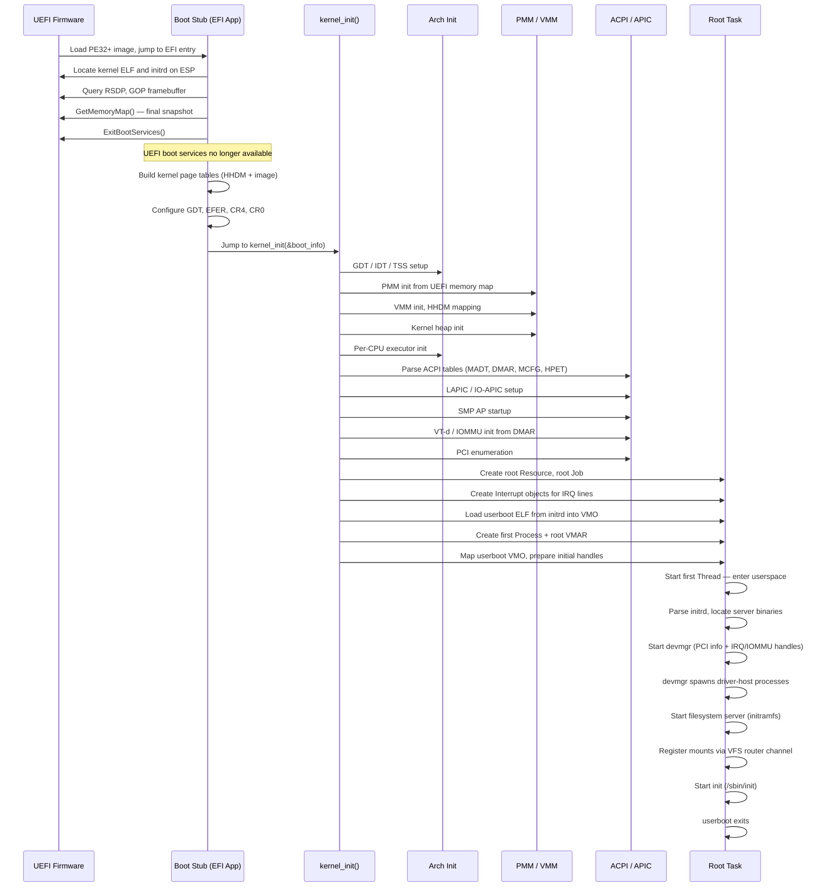

# Boot Procedure

Hadron boots via a custom UEFI application rather than a third-party bootloader. The boot sequence
proceeds through four discrete phases: the UEFI boot stub, kernel bootstrap, root task creation,
and userboot. Each phase has a clearly defined entry point and exit condition.

---

## Why UEFI Directly

Hadron embeds its own UEFI boot stub rather than delegating to a bootloader such as Limine. The
reasons are:

- **Direct control over the boot information contract.** The kernel's `BootInfo` struct is defined
  once in a shared crate and populated by the stub. No third-party protocol sits between the
  firmware and the kernel.
- **Accurate UEFI memory map.** The UEFI memory map is the only source of truth for which physical
  regions are usable, reserved, ACPI-reclaimable, or firmware-runtime. Passing it directly to the
  PMM and IOMMU setup avoids translation errors.
- **Framebuffer and GOP.** The GOP protocol provides the linear framebuffer descriptor before
  `ExitBootServices`, which the kernel uses to set up the early console without polling legacy VGA.
- **Path to Secure Boot.** A self-contained EFI application can be signed and enrolled without
  depending on a third-party shim or bootloader chain.

---

## Phase Overview



---

## Phase 1: UEFI Boot Stub

The stub is a standard PE32+ EFI application compiled for the `x86_64-unknown-uefi` target. UEFI
firmware discovers it on the EFI System Partition (ESP) and transfers control to the EFI entry
point with the `SystemTable` and `ImageHandle` arguments.

### Step-by-step

**1. Image loaded by firmware.**
The UEFI firmware loads the PE32+ binary into memory and calls its entry point. Boot services are
fully available at this point.

**2. Collect boot information.**
The stub uses boot services to gather everything the kernel needs:

- **Memory map** — `GetMemoryMap()` returns the full `EfiMemoryDescriptor` array describing every
  physical memory region (conventional, reserved, ACPI reclaimable, MMIO, etc.).
- **RSDP pointer** — located via the `EFI_ACPI_20_TABLE_GUID` configuration table entry. Passed to
  the kernel as a physical address for ACPI parsing.
- **GOP framebuffer** — the `EFI_GRAPHICS_OUTPUT_PROTOCOL` provides the base physical address,
  dimensions, pixel format, and stride of the linear framebuffer.
- **Kernel ELF** — the stub reads the kernel ELF binary from the ESP (e.g., `\EFI\HADRON\kernel`)
  and copies it into a buffer of `EfiLoaderData` pages.
- **Initrd** — the initial RAM disk (CPIO archive) is read from the ESP and placed into a separate
  `EfiLoaderData` buffer. Its physical address and length are recorded for the kernel.

**3. ExitBootServices().**
The stub calls `ExitBootServices()` with the memory map key obtained in step 2. After this call,
UEFI runtime services are still available but boot services (including memory allocation, protocols,
and console I/O) are not. The stub must not call any boot service after this point.

**4. Build kernel page tables.**
With boot services gone, the stub sets up the initial set of page tables that the kernel will
inherit:

- **HHDM (Higher Half Direct Map)** — all physical memory is identity-mapped at the HHDM base
  address (a high virtual address, typically `0xFFFF_8000_0000_0000`). The PMM, ACPI parser, and
  early device access all depend on this mapping. 2 MiB huge pages are used wherever possible to
  minimize TLB pressure.
- **Kernel image** — the kernel ELF segments are mapped at the kernel's link-time virtual base
  (`0xFFFF_FFFF_8000_0000`). `.text` and `.rodata` sections get read-only or read-execute
  protection; `.data` and `.bss` get read-write.

**5. Configure CPU state.**
Before jumping to the kernel:

- A minimal GDT (null descriptor, 64-bit code, 64-bit data) is installed via `lgdt`.
- `EFER.LME` and `EFER.NXE` are confirmed set (long mode, no-execute).
- `CR4.PGE`, `CR4.PAE`, and `CR4.OSFXSR`/`CR4.OSXMMEXCPT` are set for global pages, PAE, and
  SSE exception support.
- `CR0.WP` (write protect) is enabled so kernel code cannot write to read-only pages.
- `CR3` is loaded with the address of the new PML4.

**6. Jump to kernel_init.**
The stub calls `kernel_init(&boot_info)` where `BootInfo` is a `#[repr(C)]` struct containing
pointers and lengths for the memory map, RSDP, framebuffer descriptor, kernel ELF, and initrd. The
kernel takes over from here.

---

## Phase 2: Kernel Bootstrap

`kernel_init` runs on the BSP (bootstrap processor) with interrupts disabled. It initializes all
kernel subsystems in a specific order dictated by dependencies.

**7. GDT, IDT, TSS.**
The stub installed a minimal GDT; the kernel replaces it with the full per-CPU GDT. The IDT is
populated with exception handlers (via the `abi_x86_interrupt` calling convention) and the
interrupt dispatch table. Each CPU gets its own TSS with a valid `RSP0` (kernel stack pointer for
ring-0 entry) and IST entries for double-fault and NMI stacks.

**8. PMM initialization.**
The physical memory manager reads the UEFI memory map and builds its free-page data structures
from all `EfiConventionalMemory` regions. ACPI-reclaimable regions (`EfiACPIReclaimMemory`) are
initially reserved and freed after ACPI tables are parsed. Firmware-runtime regions remain
reserved permanently.

**9. Kernel VMM and HHDM.**
The VMM takes ownership of the page tables established by the stub. The `MemoryLayout` struct is
constructed with the HHDM base and maximum physical address. The layout defines fixed virtual
regions for the kernel heap, per-CPU stacks, MMIO mappings, per-CPU data, and the vDSO. The HHDM
offset is stored in a global atomic so that any code can call `phys_to_virt` without carrying the
offset as a parameter.

**10. Kernel heap.**
The kernel heap allocator is initialized from a 4 MiB region carved out of the kernel heap virtual
address range. The allocator grows on demand by requesting additional pages from the VMM.

**11. Per-CPU executor.**
Each CPU runs an async executor responsible for scheduling kernel tasks (interrupt handlers,
system call continuations, and background maintenance work). The BSP executor is initialized here;
AP executors are initialized after SMP startup (step 13).

**12. ACPI parsing.**
The ACPI handler translates ACPI table physical addresses via the HHDM. The following tables are
parsed:

| Table | Purpose |
|-------|---------|
| MADT  | Discover logical CPUs (LAPIC entries) and I/O APICs |
| DMAR  | VT-d remapping hardware units and device scope |
| MCFG  | PCIe MMIO configuration space base addresses |
| HPET  | High-precision event timer base address |
| FADT  | Power management ports and ACPI version |
| SRAT  | NUMA topology (optional, used for memory zone placement) |

**13. LAPIC, IO-APIC, and SMP startup.**
The BSP LAPIC is enabled. IO-APIC redirection entries are programmed for each IRQ based on the
MADT interrupt source override table. SMP startup issues `INIT-SIPI-SIPI` sequences to each AP
listed in the MADT. Each AP runs through a short trampoline (in conventional memory) that enables
paging, loads the GDT, initializes its TSS, and calls into the per-CPU setup path before joining
the executor.

**14. IOMMU (VT-d) initialization.**
The DMAR table is parsed to locate each remapping hardware unit (DRHD). For each unit, the kernel
programs the root and context tables, enables address translation, and sets the default domain to
block all DMA. Per-device domains are created lazily when a driver calls `bti_create`. See the
[IOMMU and Device Isolation](iommu.md) chapter for details.

**15. PCI enumeration.**
PCIe configuration space is accessed via the MMIO mechanism described by the MCFG table. The
enumerator walks all bus/device/function combinations, reads vendor/device IDs and class codes,
and builds a list of `PciDevice` descriptors. These are passed to userboot for `devmgr` to use.

---

## Phase 3: Root Task Creation

After kernel subsystems are fully initialized, the kernel creates the initial userspace environment.

**16. Root Resource and root Job.**
A root `Resource` object is created with full system authority. A root `Job` is created as the
ancestor of all processes. The Job hierarchy enforces policy (resource limits, capability
constraints) across the process tree.

**17. Interrupt objects.**
For each IRQ line discovered in the MADT, the kernel creates an `Interrupt` kernel object. These
objects let drivers wait for hardware interrupts without polling. The root resource holds the
`Interrupt` handles, and `devmgr` distributes them to driver processes.

**18. Userboot ELF into VMO.**
The initrd is located in physical memory via the address recorded in `BootInfo`. The userboot ELF
binary is extracted from the CPIO archive and its contents are copied into a VMO (Virtual Memory
Object). The VMO is sized to the ELF's memory footprint.

**19. First Process and root VMAR.**
A `Process` object is created with a fresh root VMAR covering the full user address space
(`0x0000_0000_0000_1000` to `0x0000_7FFF_FFFF_FFFF`). The userboot VMO is mapped into this VMAR
at the ELF's preferred load address with appropriate segment protections.

**20. Initial handles.**
The first process receives a curated set of handles in its initial handle table:

| Handle | Object | Purpose |
|--------|--------|---------|
| `H_ROOT_RESOURCE` | Root Resource | Full system capability authority |
| `H_ROOT_JOB`      | Root Job      | Process tree root |
| `H_BOOT_VMO`      | Initrd VMO    | Full initrd image for userboot to parse |
| `H_LOG_CHANNEL`   | Channel       | Write end of kernel log channel |
| `H_VFS_CHANNEL`   | Channel       | VFS router channel for mount registration |

**21. Start first thread.**
A `Thread` object is created for the userboot process. Its initial register state is set to enter
the userboot ELF entry point with the stack pointer pointing to a freshly allocated user stack.
The thread is made runnable and the scheduler picks it up on the next tick. The BSP returns to its
executor loop.

---

## Phase 4: Userboot

Userboot runs entirely in ring 3. It has no special kernel privileges beyond the handles it was
given.

**22. Parse initrd.**
Userboot reads the initrd VMO as a CPIO archive and builds an in-memory index of all files,
mapping names to offsets within the archive.

**23. Start devmgr.**
Userboot spawns the device manager (`devmgr`) process. It passes `devmgr` the PCI device list
(encoded in the boot VMO), `Interrupt` handles for each IRQ line, and `Iommu` handles for IOMMU
domains. `devmgr` runs with a subset of the root resource's authority, sufficient to create
`Bti` objects and map MMIO regions.

**24. devmgr spawns driver servers.**
`devmgr` matches each PCI device against its driver database by vendor/device ID and class code.
For each match, it spawns a driver-host process and hands it the appropriate MMIO VMO, `Interrupt`,
and `Bti` handle. The driver then enters its service loop.

**25. Start filesystem server.**
Userboot spawns the initramfs filesystem server, passing it the boot VMO as its backing store.
The server registers itself as the handler for the `/` prefix via the VFS router channel.

**26. Register mounts.**
Each filesystem server sends a `vfs_mount` message on the VFS router channel with a path prefix
and a channel endpoint. The kernel's `VfsRouter` records the mapping.

**27. Start init.**
Once the root filesystem is mounted, userboot opens `/sbin/init` via `vnode_open` and spawns it
using `task_spawn`. Init takes ownership of the process tree and begins system startup.

**28. Userboot exits.**
Userboot calls `task_exit(0)`. Its handle table is dropped, closing all handles it held. The root
Resource and root Job handles were already transferred to init during startup.

---

## Boot Information Structure

The `BootInfo` struct is defined in a shared crate (no `std`, `#[repr(C)]`) and is the sole
interface between the stub and the kernel:

```rust
#[repr(C)]
pub struct BootInfo {
    /// UEFI memory map: pointer to EfiMemoryDescriptor array.
    pub memory_map_ptr: u64,
    pub memory_map_len: usize,
    pub memory_descriptor_size: usize,

    /// Physical address of the RSDP (ACPI root pointer).
    pub rsdp_phys: u64,

    /// Linear framebuffer descriptor.
    pub framebuffer: FramebufferInfo,

    /// Initrd: physical address and byte length.
    pub initrd_phys: u64,
    pub initrd_len: usize,

    /// HHDM virtual base address (set by stub page table builder).
    pub hhdm_offset: u64,

    /// KASLR slide applied to kernel virtual address (0 = disabled).
    pub kaslr_slide: u64,

    /// Base address for kernel virtual regions (heap, stacks, MMIO).
    pub regions_base: u64,

    /// Physical address and size of the loaded kernel image.
    pub kernel_phys: u64,
    pub kernel_size: u64,

    /// Boot page table pool (physical base and page count) for reclamation.
    pub boot_pt_pool_phys: u64,
    pub boot_pt_pool_pages: u64,

    /// Boot services vtable (valid until kernel switches CR3).
    pub boot_services: *const BootServices,
}
```

The stub fills every field before calling `kernel_init`. The kernel must not modify `BootInfo`
after entry — it may be located in UEFI loader data pages that the PMM will reclaim once the
memory map is consumed.

### Two-Phase Logging

The kernel uses a two-phase logging architecture:

- **Phase 0** (early boot): Before `PerCpuState` is initialized, log macros write
  synchronously to COM1 via inline `out` instructions. No ring buffer or sinks are used.
- **Phase 1** (after per-CPU init): Once `cpu_is_initialized()` returns true, log entries
  are buffered in per-CPU ring buffers and dispatched to registered sinks (e.g. serial,
  framebuffer) on `flush()`.

The transition occurs when `init_gs_base()` sets the `initialized` flag in the BSP's
`PerCpuState` struct.
