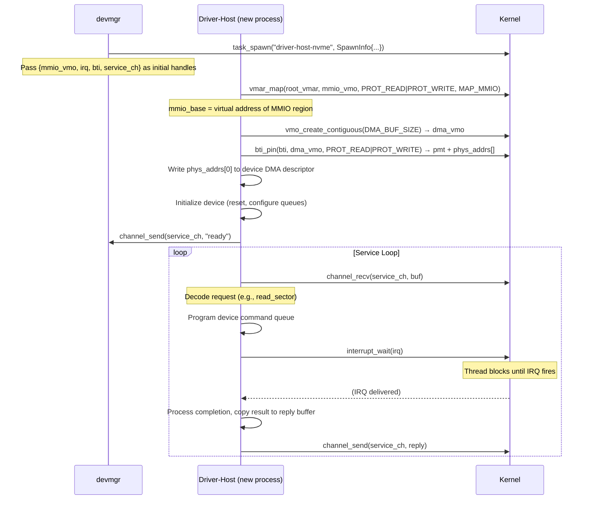
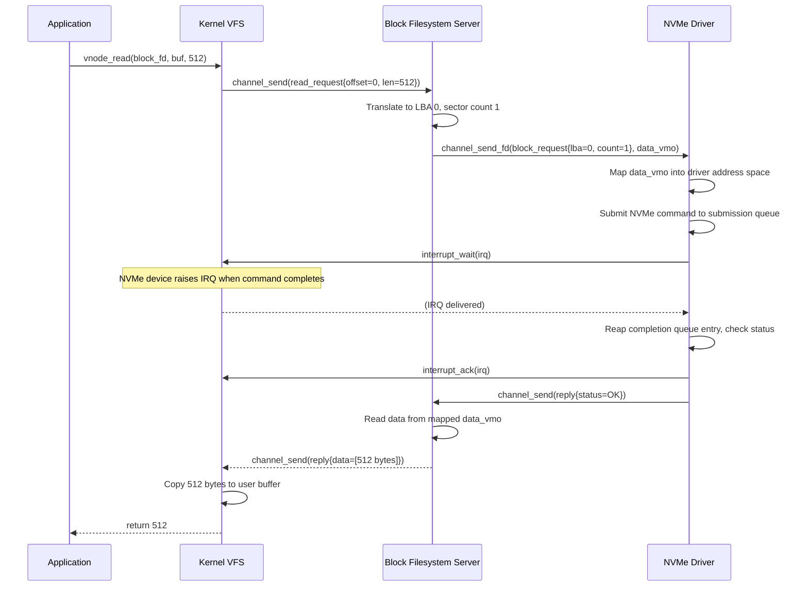

# Driver Architecture

All hardware drivers in Hadron run in userspace. There is no in-kernel driver model, no kernel
module loading, and no ring-0 device code outside of the interrupt dispatch stub. A driver is an
ordinary userspace process that has been given specific capability handles granting it access to
one device's resources.

---

## Driver Hosting Model

### devmgr

The device manager (`devmgr`) is the first privileged userspace process started by userboot. It
receives:

- The PCI device list (encoded in the boot VMO) — a flat array of `PciDeviceInfo` records
  containing vendor ID, device ID, class code, subclass, BAR physical addresses, and BAR sizes.
- `Interrupt` object handles for each IRQ line.
- `Iommu` object handles for each VT-d unit.
- The root `Resource` handle (or a sufficiently-privileged sub-resource).

`devmgr` maintains a driver database: a table mapping (vendor ID, device ID) pairs and PCI class
codes to driver binary names. For each PCI device in the device list, `devmgr` looks up the
matching driver binary in the initramfs, then spawns a **driver-host** process.

### Driver-Host Process

A driver-host is a process containing exactly one driver. It receives via its initial handle table:

| Handle | Object | Rights |
|--------|--------|--------|
| `mmio_vmo` | `MmioFrame` VMO | `READ \| WRITE \| MAP` |
| `irq` | `Interrupt` | `READ \| WAIT` |
| `bti` | `Bti` | `READ \| WRITE` |
| `service_ch` | Channel | `READ \| WRITE \| TRANSFER` |

The `service_ch` is a channel endpoint connected to `devmgr`'s side. The driver uses it to
announce readiness and to receive device operation requests from client processes.

`devmgr` does not pass the root resource to drivers. A driver cannot create new privileged objects
beyond what it was given.

---

## Driver Startup Sequence



---

## MMIO Access

The MMIO VMO is a special kernel object wrapping a physical MMIO range (one of the device's BARs).
The driver maps it with the `MAP_MMIO` (uncacheable) flag:

```rust
let mmio_base = vmar_map(
    root_vmar,
    mmio_vmo,
    0,                       // offset within VMO
    bar_size,
    PROT_READ | PROT_WRITE,
    MAP_MMIO,                // forces PAT type = UC (uncacheable)
)?;
```

After mapping, the driver accesses device registers through the virtual address `mmio_base`. The
kernel ensures this mapping is uncacheable by setting the appropriate page table cache attribute
(PAT = 0, UC). Write-combining can be requested for framebuffer BAPs by using `MAP_WC` instead.

The driver must not access physical addresses directly — only through the mapped virtual address
returned by `vmar_map`. The MMIO VMO ensures the kernel can account for all active MMIO mappings
and revoke them if the driver process is killed.

---

## DMA

Drivers allocate DMA buffers by creating VMOs and pinning them through the `Bti`:

```rust
// Allocate a physically contiguous DMA buffer.
let dma_vmo = vmo_create_contiguous(DMA_BUFFER_SIZE)?;

// Pin it for device access. The kernel programs the IOMMU.
let (pmt, phys_addrs) = bti_pin(bti, dma_vmo, PROT_READ | PROT_WRITE)?;

// Map it into driver address space for CPU access.
let dma_virt = vmar_map(root_vmar, dma_vmo, 0, DMA_BUFFER_SIZE, PROT_READ | PROT_WRITE, 0)?;

// Program the device with the physical address.
device_reg_write(DESCRIPTOR_BASE, phys_addrs[0]);
```

When the DMA operation is complete, the driver unpins the buffer to release the IOMMU mapping:

```rust
pmt_unpin(pmt)?;
```

After `pmt_unpin`, the driver must not use `phys_addrs` again. The physical pages may be
reassigned. The VMO and its virtual mapping remain valid until explicitly unmapped and dropped.

For scatter-gather DMA (common in NVMe and AHCI), `bti_pin` returns one physical address per
page. The driver is responsible for building the scatter-gather list from this array.

---

## Interrupt Handling

Interrupts are delivered to drivers through the `Interrupt` kernel object:

```rust
loop {
    // Block until the hardware IRQ fires.
    interrupt_wait(irq)?;

    // Process all completions in the device queue.
    while let Some(completion) = device_completion_queue_pop() {
        process_completion(completion);
    }

    // Acknowledge the interrupt to the LAPIC/IO-APIC.
    interrupt_ack(irq)?;
}
```

`interrupt_wait` blocks the calling thread until the hardware IRQ fires. The kernel's interrupt
handler (running in the IDT stub) sets the signal on the `Interrupt` object, which wakes the
waiting thread. The driver then processes completions and calls `interrupt_ack` to re-enable the
IRQ at the LAPIC.

MSI (Message Signaled Interrupts) and MSI-X are supported through the same `Interrupt` object
interface — the kernel programs the MSI capability register with the appropriate vector and masks
during `Interrupt` object creation.

---

## Service Channel Protocol

Drivers expose their services to client processes through a channel. The protocol is driver-defined
but typically follows a request-reply pattern:

```
Client → Driver: [ opcode: u32 ] [ args... ]
Driver → Client: [ status: i32 ] [ result... ]
```

For block drivers, a typical request contains the operation (read/write), LBA, sector count, and
a VMO handle for the data buffer. The driver maps the VMO, performs the I/O, and sends a reply
with the completion status.

For character devices (serial ports, input devices), the pattern is more varied. Input devices
may push events to the client without a preceding request.

---

## End-to-End Example: Block Driver Reading a Sector

A client application calls `read(block_fd, buf, 512)` to read 512 bytes from an NVMe device.



The NVMe driver never touches application memory directly. The data flows through a VMO that the
filesystem server allocated and passed via fd transfer. The driver maps the VMO, the device writes
into it via DMA, and the filesystem server reads the result.

---

## Driver Crash Isolation

If a driver-host process crashes (segfault, assertion failure, etc.), the kernel:

1. Closes all handles in the driver's handle table, including the `service_ch`, `Interrupt`,
   `Bti`, and all active `Pmt` objects.
2. Dropping `Pmt` objects triggers IOMMU unmap for all pinned buffers — the device loses DMA
   access to its buffers immediately.
3. Dropping the `Interrupt` handle disables the IRQ at the IO-APIC.
4. Dropping `service_ch` makes the peer end (`devmgr`'s channel) readable with a `PEER_CLOSED`
   signal.

`devmgr` observes the `PEER_CLOSED` signal and can decide to restart the driver process or
mark the device as unavailable. Client processes that had open connections to the device receive
`EPIPE` or `PEER_CLOSED` on their channels, allowing them to handle the failure gracefully.

This isolation guarantee holds even if the driver was actively performing DMA at the time of the
crash. The IOMMU mapping is removed synchronously when the `Pmt` is dropped, before the physical
pages can be reassigned.
