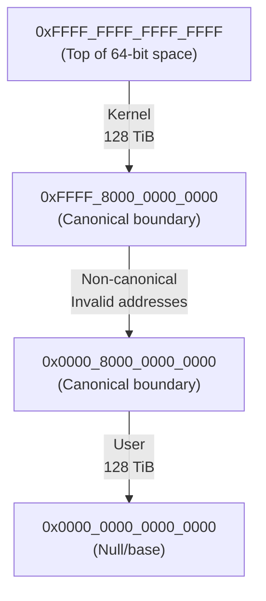
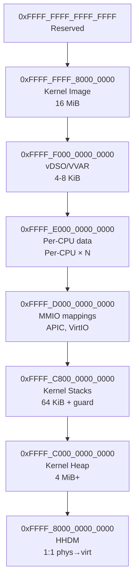
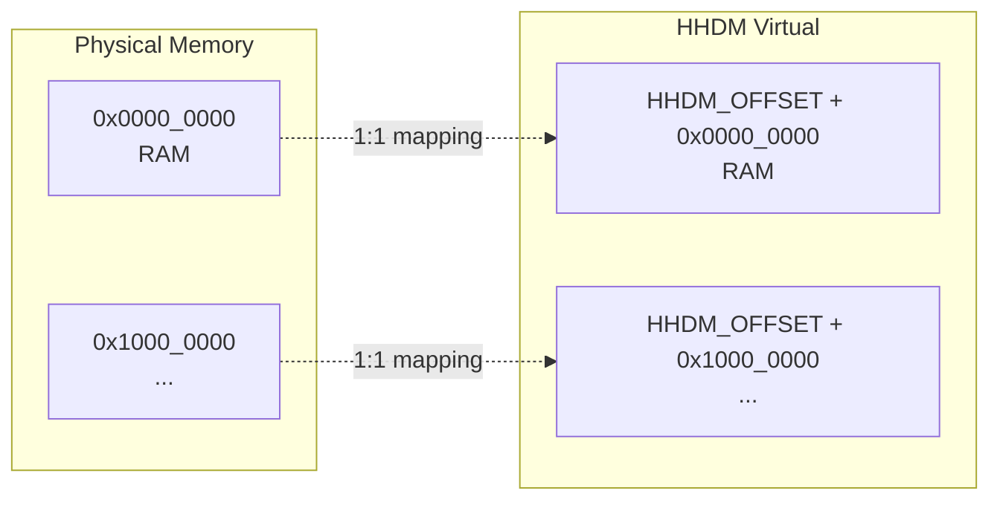
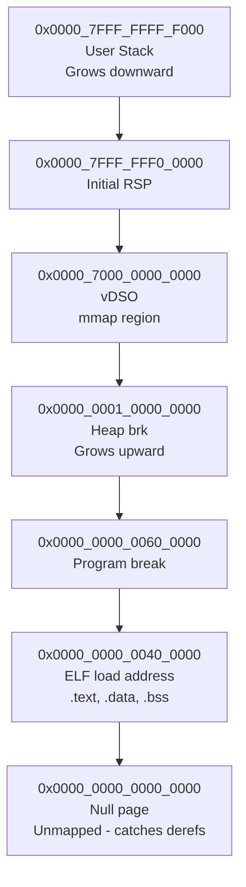
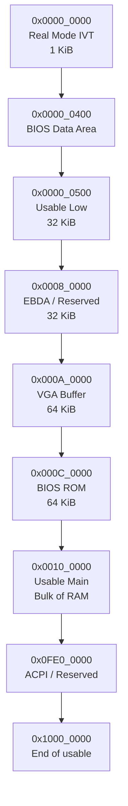

# Memory Layout

This chapter documents the x86_64 virtual and physical memory layout used by Hadron.

## x86_64 Virtual Address Space

x86_64 uses 48-bit virtual addresses with canonical form: addresses must have bits 48-63 either all zeros (lower half) or all ones (upper half). This creates a natural split between userspace and kernel space.

```
0xFFFF_FFFF_FFFF_FFFF  ┌──────────────────────────────┐
                       │                              │
                       │   Kernel Space (upper half)  │
                       │                              │
0xFFFF_8000_0000_0000  ├──────────────────────────────┤ ← Canonical boundary
                       │                              │
                       │   Non-canonical hole          │
                       │   (addresses are invalid)     │
                       │                              │
0x0000_8000_0000_0000  ├──────────────────────────────┤ ← Canonical boundary
                       │                              │
                       │   User Space (lower half)    │
                       │                              │
0x0000_0000_0000_0000  └──────────────────────────────┘
```

Each half provides 128 TiB of addressable space.



## Kernel Virtual Memory Map



**Key regions (top to bottom):**
- **Reserved**: Top of kernel space, unused
- **Kernel Image**: Code, data, BSS (~16 MiB)
- **vDSO/VVAR**: Kernel-provided shared library and variables (4-8 KiB)
- **Per-CPU Data**: Per-CPU regions (size varies with CPU count)
- **MMIO Mappings**: Device memory (APIC, I/O APIC, VirtIO BAR regions)
- **Kernel Stacks**: Per-task kernel stacks with guard pages (64 KiB + 4 KiB guard each)
- **Kernel Heap**: Dynamic allocations (starts 4 MiB, grows upward)
- **HHDM**: Higher Half Direct Map (all physical memory mapped at phys + HHDM_OFFSET)

> **Note**: Exact addresses will be adjusted during implementation. The HHDM base is provided by the Limine bootloader and may vary.

## Higher Half Direct Map (HHDM)

The HHDM is a direct mapping of all physical memory into the kernel's virtual address space. Given a physical address `P`, the corresponding virtual address is `P + HHDM_OFFSET`.



**Why HHDM?**
- Walking page tables requires reading physical memory — HHDM makes this trivial
- No need for recursive page table mapping
- Any physical address can be accessed immediately
- Limine provides this automatically, so the kernel doesn't need to set it up

**Translation functions**:
```rust
fn phys_to_virt(phys: PhysAddr) -> VirtAddr {
    VirtAddr::new(phys.as_u64() + HHDM_OFFSET)
}

fn virt_to_phys(virt: VirtAddr) -> PhysAddr {
    PhysAddr::new(virt.as_u64() - HHDM_OFFSET)
}
```

## User Virtual Memory Map



**Key regions (top to bottom):**
- **User Stack**: Starts at top, grows downward (~8 MiB default)
- **Initial RSP**: Stack pointer at program start
- **mmap/vDSO Region**: Shared libraries, anonymous mappings, kernel vDSO
- **Heap (brk)**: Dynamic allocation region, grows upward
- **BSS/Data/Text**: ELF image (.text read-only, .data initialized, .bss zero)
- **Null page**: Unmapped guard page to catch null pointer dereferences

### Address Regions

| Region | Start | End | Purpose |
|--------|-------|-----|---------|
| Null guard | `0x0000` | `0x0FFF` | Unmapped — traps null pointer dereferences |
| ELF load | `0x0040_0000` | varies | Default ELF base address |
| Heap (brk) | end of BSS | upward | `brk()`/`sbrk()` region |
| mmap | `~0x7000_0000_0000` | downward | `mmap()` allocations |
| vDSO | `~0x7000_0000_0000` | fixed | Kernel-provided shared library |
| Stack | `~0x7FFF_FFF0_0000` | upward (grows down) | User stack, ~8 MiB default |

## Page Table Structure

x86_64 uses 4-level page tables (with optional 5-level for 57-bit addresses):

```
CR3 → PML4 (Page Map Level 4)
       │
       ├── Entry 0-255: User space (lower half)
       │    └── PDPT → PD → PT → 4 KiB pages
       │
       └── Entry 256-511: Kernel space (upper half)
            └── PDPT → PD → PT → 4 KiB pages
            (Shared across all processes)
```

### Page Sizes

| Level | Size | Use Case |
|-------|------|----------|
| PT (4 KiB) | Standard pages | General use |
| PD (2 MiB) | Huge pages | Kernel HHDM, large allocations |
| PDPT (1 GiB) | Giant pages | HHDM for large memory systems |

### Kernel/User Split

The upper half of the PML4 (entries 256-511) is shared across all processes by copying these entries from the kernel's PML4 into every new process's PML4. This means:

- Kernel mappings are identical in every address space
- Switching between processes only affects the lower half
- No TLB flush needed for kernel entries (use GLOBAL flag)

## Physical Memory Layout (Typical QEMU)



**Key regions (physical address order):**
- **Real Mode IVT**: First 1 KiB (interrupt vectors, BIOS data)
- **BIOS Data Area**: System variables and parameters
- **Usable Low**: Conventional memory (first 640 KiB mark)
- **EBDA**: Extended BIOS Data Area / Reserved
- **VGA Buffer**: Video memory region (640 KiB mark)
- **BIOS ROM**: Firmware code and tables
- **1 MiB Mark**: Start of extended memory (where kernel usually loads)
- **Usable Main**: Bulk of physical RAM (allocated by PMM)
- **ACPI / Reserved**: ACPI tables, reserved regions

The bootloader's memory map tells us exactly which regions are usable. The PMM bitmap allocator tracks this.
