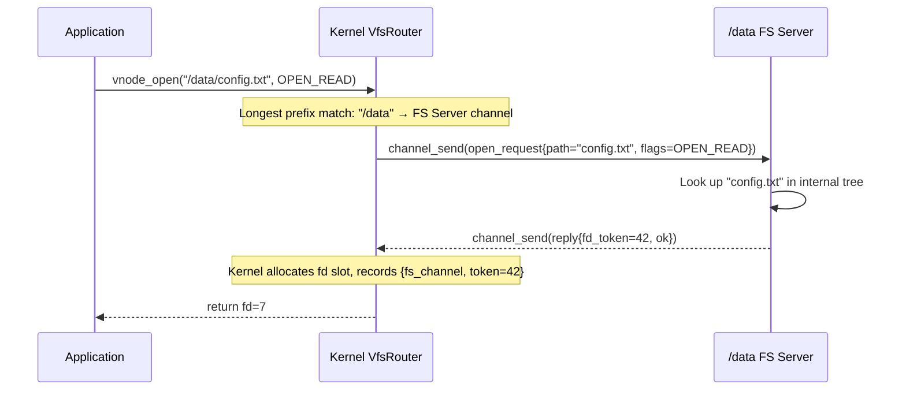
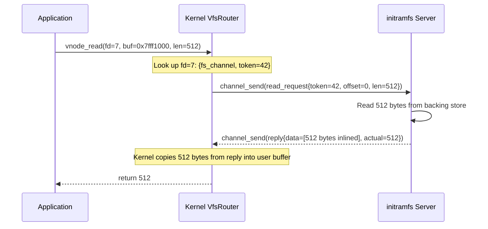
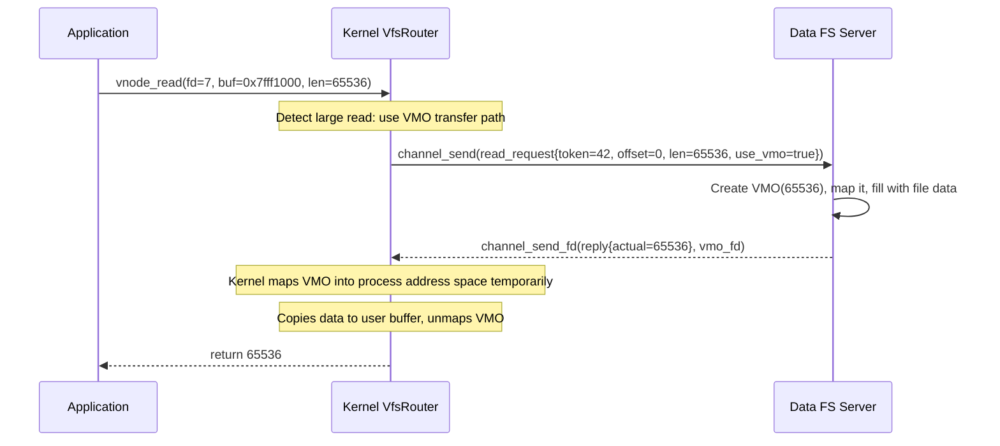

# VFS Routing Layer

Hadron's VFS layer is intentionally minimal. The kernel does not implement any filesystem logic
itself: no directory traversal, no inode caches, no permission evaluation, and no symlink
resolution. Instead, the kernel maintains a routing table that maps path prefixes to filesystem
server channels. When a process opens a file, the kernel performs one lookup to find the
responsible server and forwards the request.

Everything above that routing lookup — path resolution, permission checks, symlink following,
file locking — is the filesystem server's responsibility.

---

## VfsRouter

The central data structure is `VfsRouter`:

```rust
pub struct VfsRouter {
    /// Maps path prefix to the channel endpoint for the responsible FS server.
    mounts: BTreeMap<String, Arc<Channel>>,
}
```

The `BTreeMap` key is a normalized path prefix string such as `"/"`, `"/data"`, or
`"/proc"`. Values are `Arc<Channel>` — a reference-counted handle to the kernel-side channel
endpoint connected to the filesystem server.

Mount entries are registered by filesystem servers during boot via the `vfs_mount` syscall, which
sends a message on the VFS router channel (`H_VFS_CHANNEL`) that the kernel processes to add an
entry.

### Longest Prefix Matching

When routing a request for path `P`, the `VfsRouter` performs longest prefix matching:

1. Iterate over all entries in the `BTreeMap` in reverse key order (longer keys sort later in
   lexicographic order when paths are compared correctly, but the lookup must normalize first).
2. For each entry with prefix `K`, check whether `P` starts with `K` followed by either a `/`
   separator or the end of the string.
3. The entry with the longest matching prefix wins.

Example: given mounts at `"/"` and `"/data"`:
- `/data/config.txt` matches `"/data"` (length 5 > length 1).
- `/etc/passwd` matches `"/"` (only one candidate).
- `/datafile` does NOT match `"/data"` because the prefix is not followed by `/` or end-of-string;
  it matches `"/"`.

The algorithm runs in `O(n)` in the number of mounted filesystems, which is small (typically under
20) and dominated by the channel message overhead.

---

## Per-Process Namespace

Each process has a view of the mount table filtered by its capability set. A process spawned with
a reduced namespace cannot see mount points that its creator did not pass to it. The namespace is
a subset of the global `VfsRouter` table, constrained by the handles present in the process's
handle table.

This is the mechanism by which a sandboxed process can be given read-only access to `/data` while
being completely unable to see `/dev` or `/proc`. The kernel enforces this at the routing step:
if the resolved mount point is not in the process's namespace, the lookup returns `EACCES`.

---

## Request Protocol

The kernel forwards vnode requests to filesystem servers as channel messages. The protocol is a
simple fixed-header format:

```
[ op: u32 ] [ flags: u32 ] [ path_len: u32 ] [ ... path bytes ... ] [ ... extra args ... ]
```

The filesystem server processes the message, performs the operation on its internal state, and
sends a reply on the same channel. The kernel blocks the calling thread until the reply arrives,
then copies the result back to userspace.

Large reads and writes avoid copying through the kernel by using VMOs: the filesystem server
creates a VMO, maps it, fills it with data, and passes the VMO handle in the reply. The caller
maps the VMO and reads directly from it. Small reads (under a threshold, typically 4096 bytes)
are inlined in the reply message to avoid the overhead of VMO creation.

---

## End-to-End Examples

### Opening a File

A userspace process calls `open("/data/config.txt", O_RDONLY)`.



The returned `fd` is an index into the process's handle table. The kernel records which filesystem
server owns it and what token the server assigned. Subsequent `vnode_read`, `vnode_write`, and
`vnode_stat` calls on `fd` are forwarded to the same server with the token as the file identifier.

### Reading from a File (Small Read)

A process calls `read(fd, buf, 512)` where `fd` refers to a file served by the initramfs server.



### Reading from a File (Large Read via VMO)

A process calls `read(fd, buf, 65536)` — a 64 KiB read that crosses the inline threshold.



The VMO path avoids double-copying through the kernel message buffer for large I/O. The threshold
between inline and VMO paths is a tunable constant in the VFS router.

---

## Symlinks, Permissions, and Path Resolution

The kernel's VfsRouter never follows symlinks, checks Unix permission bits, or resolves `.` and
`..` components. These are the filesystem server's responsibility. The kernel sends the raw path
(normalized to remove duplicate slashes and trailing slashes) and trusts the server to resolve it
correctly within its own namespace.

This design means:

- The kernel VFS has zero filesystem-format-specific logic.
- New filesystem types (ext2, FAT, NFS) need no kernel changes — only a new userspace server.
- Security-sensitive operations (setuid execution, permission checking) are isolated in userspace
  where they can be audited and tested independently.
- The kernel cannot be attacked via malformed filesystem metadata; the worst a buggy server can
  do is return incorrect data to its clients.

---

## Mount and Unmount Syscalls

These syscalls are handled specially: they operate on the `VfsRouter` state rather than forwarding
to an existing server.

| Syscall | Description |
|---------|-------------|
| `vfs_mount` (design) | Register a channel as the handler for a path prefix. Requires the process to hold the VFS router channel handle. |
| `vfs_unmount` (design) | Remove a path prefix registration. The channel endpoint is released. |

In the current implementation, mount registration is performed during boot via messages on the
`H_VFS_CHANNEL` handle passed to userboot. Runtime mounting by arbitrary processes is gated on
holding the appropriate capability.
