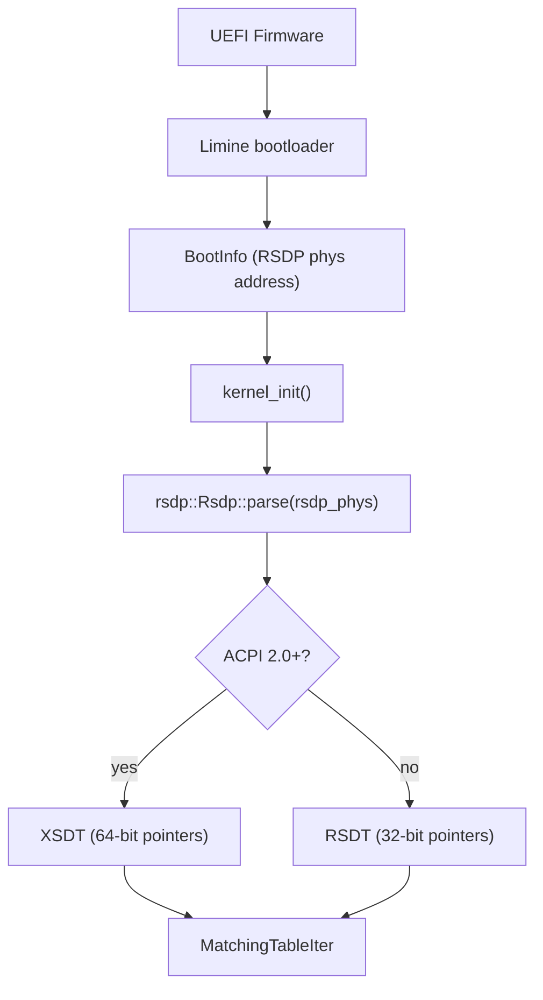
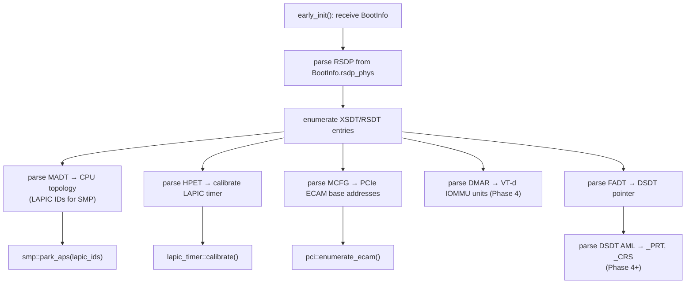

# ACPI and Hardware Discovery

Hadron discovers hardware topology through ACPI (Advanced Configuration and Power Interface) tables provided by the firmware. The `hadron-acpi` crate (`crates/parse/acpi/`) is a standalone, `no_std` table parsing library used during early kernel boot. It does not depend on `alloc` by default; all iteration is done through safe byte-slice iterators backed by an `AcpiHandler` trait that maps physical memory on demand.

## RSDP Discovery

The Root System Description Pointer (RSDP) is the entry point into all ACPI tables. On UEFI systems, the bootloader (Limine) provides the physical address of the RSDP through its boot information structure — the kernel does not need to scan legacy BIOS memory regions.



The RSDP structure has two versions:
- ACPI 1.0: 20-byte RSDP pointing to the RSDT (32-bit physical addresses).
- ACPI 2.0+: 36-byte RSDP extending the original with an `xsdt_address` field (64-bit). The XSDT supersedes the RSDT on modern hardware.

`hadron-acpi` validates the RSDP checksum (byte sum of the structure must equal zero) before returning a parsed result.

## XSDT/RSDT Parsing

The `AcpiTables` struct provides a unified interface over both XSDT and RSDT:

```rust
let tables = AcpiTables::new(rsdp_physical_address, my_handler)?;

// Iterate all tables matching a 4-byte signature
for entry in tables.iter_signature(b"APIC") {
    let madt = Madt::parse(&handler, entry.phys_addr)?;
}
```

`MatchingTableIter` walks the XSDT/RSDT's array of physical addresses, maps each SDT header through the `AcpiHandler`, validates its checksum, and yields only tables with a matching signature.

### AcpiHandler Trait

```rust
pub trait AcpiHandler {
    /// Map a physical region into the virtual address space.
    /// Returns a virtual pointer valid for `length` bytes.
    unsafe fn map_physical_region(&self, phys: u64, length: usize) -> *const u8;
}
```

The kernel implements `AcpiHandler` using the HHDM: `phys_to_virt(phys)`. This is a trivial O(1) operation — no dynamic mapping is needed because all physical memory is accessible through the HHDM.

## System Description Table Header

Every ACPI table begins with a 36-byte `SdtHeader` (System Description Table Header):

| Offset | Size | Field |
|--------|------|-------|
| 0 | 4 | Signature (ASCII) |
| 4 | 4 | Length (total bytes including header) |
| 8 | 1 | Revision |
| 9 | 1 | Checksum (sum of all bytes == 0) |
| 10 | 6 | OEM ID |
| 16 | 8 | OEM Table ID |
| 24 | 4 | OEM Revision |
| 28 | 4 | Creator ID |
| 32 | 4 | Creator Revision |

`SdtHeader::SIZE` is 36. All table parsers in `hadron-acpi` skip this header and begin parsing table-specific fields at offset 36.

## MADT: CPU Topology and Interrupt Controllers

The Multiple APIC Description Table (MADT, signature `APIC`) describes the interrupt controller topology. It is the primary source of CPU topology information for SMP bringup.

The MADT header (after the SDT header) contains:
- `local_apic_address` (u32): default physical address of all Local APICs.
- `flags` (u32): bit 0 set means dual 8259 PICs are present.

After the header, the table contains a variable-length list of typed entries:

| Type | Name | Contents |
|------|------|----------|
| 0 | Processor Local APIC | ACPI processor ID, LAPIC ID, enabled flag |
| 1 | I/O APIC | I/O APIC ID, I/O APIC base address, GSI base |
| 2 | Interrupt Source Override | remaps legacy IRQ N to Global System Interrupt M |
| 3 | NMI Source | non-maskable interrupt source |
| 4 | Local APIC NMI | per-processor NMI connection (LINT0/LINT1) |
| 5 | Local APIC Address Override | 64-bit LAPIC base override (XAPIC) |
| 9 | Processor Local x2APIC | for systems with more than 254 CPUs |

The kernel uses the MADT entries of type 0 and 9 to enumerate logical CPUs and collect their LAPIC IDs. These IDs are used during AP startup (see [SMP and Per-CPU State](smp.md)).

```rust
let madt = Madt::parse(&handler, madt_phys)?;
for entry in madt.entries() {
    match entry {
        MadtEntry::LocalApic(lapic) if lapic.flags & 1 != 0 => {
            cpu_topology.add_cpu(lapic.apic_id);
        }
        MadtEntry::IoApic(ioapic) => {
            ioapic_registry.register(ioapic.apic_id, ioapic.address, ioapic.gsi_base);
        }
        MadtEntry::InterruptSourceOverride(iso) => {
            gsi_map.override_irq(iso.irq_source, iso.gsi);
        }
        _ => {}
    }
}
```

## DMAR: IOMMU Units (VT-d)

The DMA Remapping Reporting (DMAR) table (signature `DMAR`) describes Intel VT-d DMA remapping hardware. It is used in Phase 4 to initialize the IOMMU subsystem for device isolation.

The DMAR header contains:
- `host_address_width` (u8): width of host physical addresses minus 1 (e.g., 39 for 40-bit addresses).
- `flags` (u8): bit 0 = `INTR_REMAP` (interrupt remapping supported), bit 1 = `X2APIC_OPT_OUT`.

DMAR entries follow the header:

| Type | Name | Contents |
|------|------|----------|
| 0 | DRHD (DMA Remapping Hardware Unit) | base address of a VT-d remapping unit; device scope list |
| 1 | RMRR (Reserved Memory Region) | physical memory regions that devices may access directly (legacy) |
| 2 | ATSR (ATS Root Port) | PCI Express root ports that support ATS |
| 3 | RHSA | NUMA affinity of remapping hardware |

Each DRHD entry contains a `DeviceScope` list that maps PCI buses/devices/functions to the IOMMU unit that controls them. The `INCLUDE_PCI_ALL` flag on a DRHD means the unit handles all PCI devices not claimed by another DRHD.

```rust
let dmar = Dmar::parse(&handler, dmar_phys)?;
for entry in dmar.entries() {
    match entry {
        DmarEntry::Drhd(drhd) => {
            iommu_units.register(drhd.register_base_address, drhd.flags);
            for scope in drhd.device_scopes() {
                // map PCI function to IOMMU unit
            }
        }
        _ => {}
    }
}
```

## MCFG: PCIe ECAM Configuration Space

The Memory Mapped Configuration (MCFG) table (signature `MCFG`) describes PCIe Enhanced Configuration Access Mechanism (ECAM) regions. Each entry maps a segment/bus range to a physical base address for memory-mapped PCI configuration space access.

| Field | Type | Meaning |
|-------|------|---------|
| `base_address` | u64 | Physical base of ECAM region |
| `pci_segment_group` | u16 | PCI segment group (usually 0) |
| `start_bus_number` | u8 | First bus covered |
| `end_bus_number` | u8 | Last bus covered |

With ECAM, the configuration space register for a given bus:device:function:offset is accessed at:
```
phys = base_address + ((bus - start_bus) << 20) | (device << 15) | (function << 12) | offset
```

This replaces the legacy `CF8`/`CFC` I/O port PCI config mechanism with a direct MMIO window, avoiding I/O port serialization and enabling 256 bytes of extended capability space per function.

## HPET: High-Precision Event Timer

The HPET table (signature `HPET`) describes the High Precision Event Timer. The HPET provides a stable, high-resolution counter that is not subject to the frequency variations of the LAPIC timer.

Key fields in the HPET table:

| Field | Meaning |
|-------|---------|
| `event_timer_block_id` | Hardware revision and comparator count |
| `base_address` | Address structure describing MMIO base of the HPET block |
| `hpet_number` | HPET sequence number (0 for the first HPET) |
| `main_counter_minimum_tick` | Minimum period between interrupts in femtoseconds |
| `page_protection` | Memory protection attributes for the HPET block |

The kernel uses the HPET to calibrate the LAPIC timer during boot: it reads the HPET counter before and after a known delay to determine the LAPIC timer's tick rate. After calibration the LAPIC timer drives all per-CPU scheduling ticks and the HPET is used only as a reference.

## FADT: Fixed ACPI Description Table

The Fixed ACPI Description Table (FADT, signature `FACP`) contains fixed hardware information and pointers to other tables. Key fields used by Hadron:

| Field | Usage |
|-------|-------|
| `dsdt_address` | Physical address of the Differentiated System Description Table (DSDT), which contains the AML bytecode |
| `pm_timer_block` | I/O port of the ACPI PM timer (fallback for HPET calibration) |
| `fixed_feature_flags` | Bit flags for hardware capabilities (e.g., `TMR_VAL_EXT` for 32-bit PM timer) |
| `preferred_pm_profile` | System type (desktop, mobile, server, etc.) |

The FADT also contains the `x_dsdt` field (64-bit DSDT pointer for ACPI 2.0+) which is preferred over `dsdt_address` when present.

## hadron-acpi Crate Structure

```
crates/parse/acpi/src/
  lib.rs          -- AcpiTables, AcpiHandler trait, AcpiError enum
  rsdp.rs         -- RSDP validation and parsing
  rsdt.rs         -- RSDT/XSDT iteration, MatchingTableIter
  sdt.rs          -- SdtHeader, ValidatedTable, load_table()
  madt.rs         -- Madt, MadtEntry, MadtEntryIter
  dmar.rs         -- Dmar, DmarEntry, DmarEntryIter, DeviceScope
  mcfg.rs         -- Mcfg, McfgEntry
  hpet.rs         -- HpetTable
  fadt.rs         -- Fadt
  srat.rs         -- NUMA affinity (System Resource Affinity Table)
  slit.rs         -- NUMA distance (System Locality Information Table)
  ivrs.rs         -- AMD IOMMU (I/O Virtualization Reporting Structure)
  bgrt.rs         -- Boot Graphics Resource Table (firmware logo)
  resource.rs     -- AcpiResource iterator (for _CRS methods)
  aml/            -- AML bytecode parser
    mod.rs
    namespace.rs  -- NamespaceBuilder (alloc feature)
    ...
```

The crate is `no_std` by default. The `alloc` feature enables `NamespaceBuilder`, which collects AML namespace nodes into a `Vec` for full AML evaluation.

## AML Parser

AML (ACPI Machine Language) is the bytecode language used in DSDT and SSDT tables to describe device resources, power management methods, and IRQ routing. The `aml` submodule in `hadron-acpi` implements a bytecode walker.

Key AML use cases in Hadron:

- `_PRT` (PCI Routing Table): maps PCI interrupt pins to GSI numbers. Required for correct interrupt routing on systems where PCI devices share interrupt lines.
- `_CRS` (Current Resource Settings): describes I/O ports, memory ranges, and interrupt numbers assigned to a device.
- `_STA` (Status): reports whether a device is present and enabled.
- `_HID`/`_CID`: hardware and compatible IDs for device matching.

The AML namespace is a tree of named objects. `NamespaceBuilder` (with `alloc` feature) walks the DSDT bytecode and constructs this tree. Without `alloc`, the walker can be driven in streaming fashion by registering per-opcode callbacks.

```rust
// With alloc feature
let dsdt_data: &[u8] = /* physical bytes mapped via HHDM */;
let namespace = NamespaceBuilder::new()
    .parse(dsdt_data)?
    .build();

// Look up PCI IRQ routing
let prt = namespace.evaluate("_SB.PCI0._PRT")?;
```

## Discovery Sequence During Boot



ACPI parsing is completed before AP startup. The MADT entries provide the LAPIC IDs needed to send INIT-SIPI-SIPI sequences to Application Processors. The HPET calibration must complete before the per-CPU scheduler timer is started. MCFG-based PCI enumeration proceeds after the kernel heap is initialized (PCI device records are heap-allocated).
