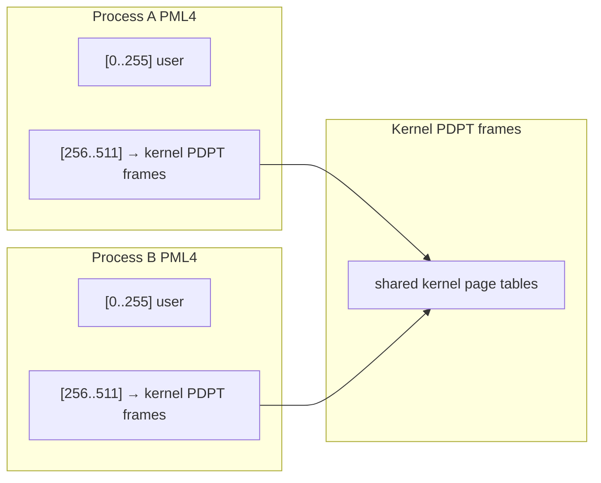
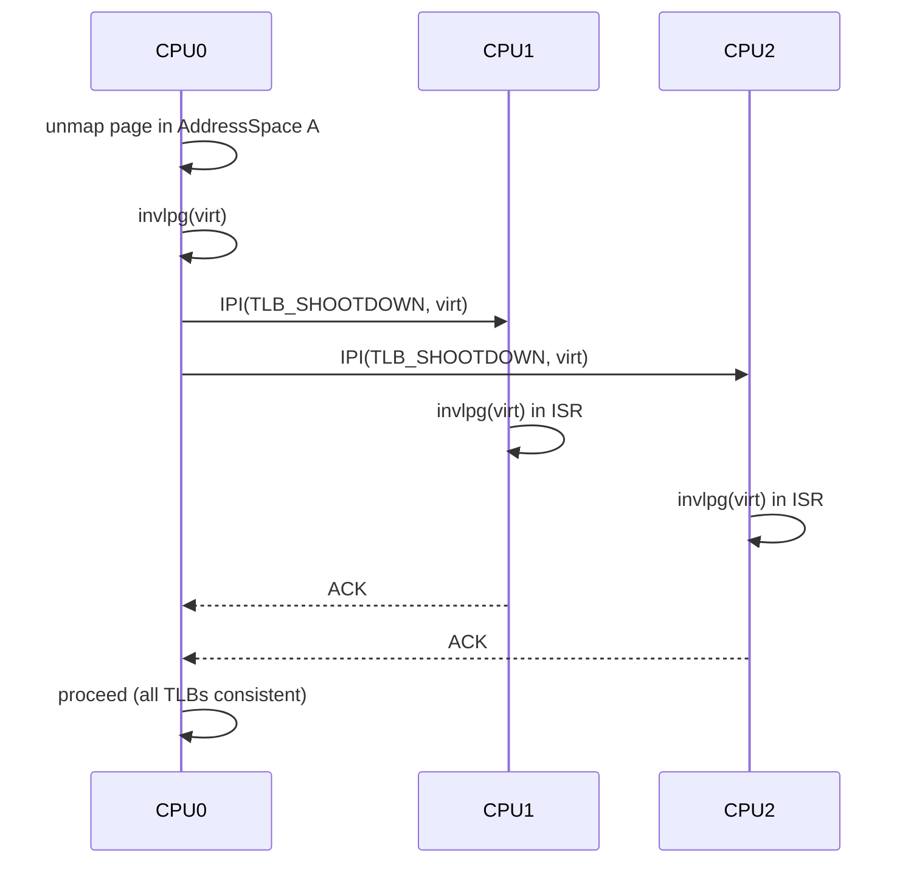
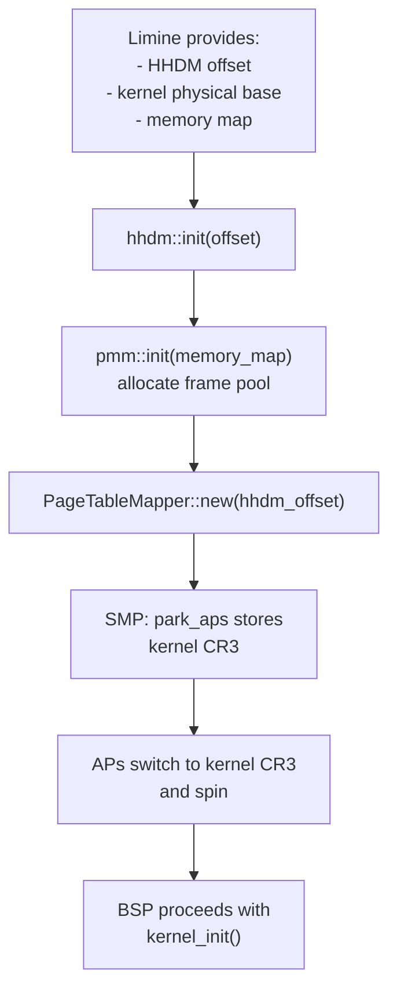

# Page Table Management

Hadron uses x86_64's four-level paging hierarchy to map virtual addresses to physical frames. Page table management is split across two crates: `hadron-mm` (`kernel/mm/`) provides the architecture-independent mapper interface and the `AddressSpace` abstraction, while `hadron-kernel` (`kernel/kernel/src/arch/x86_64/paging/`) provides the concrete x86_64 implementation.

## x86_64 Four-Level Paging

Virtual addresses on x86_64 are 48 bits wide (bits 47:0; bits 63:48 must match bit 47 for canonical form). The hardware page walker decomposes each address into five fields:

```
Bit range   Width   Table indexed
[47:39]       9     PML4  (Page Map Level 4)
[38:30]       9     PDPT  (Page Directory Pointer Table)
[29:21]       9     PD    (Page Directory)
[20:12]       9     PT    (Page Table)
[11:0]       12     Page offset (4 KiB)
```

Each table has 512 entries of 8 bytes each, occupying exactly one 4 KiB physical frame.


Huge pages skip the bottom levels:

| Page size | Levels traversed | Set-by-hardware |
|-----------|-----------------|-----------------|
| 4 KiB | PML4 → PDPT → PD → PT | — |
| 2 MiB | PML4 → PDPT → PD (PS=1) | PD entry has bit 7 set |
| 1 GiB | PML4 → PDPT (PS=1) | PDPT entry has bit 7 set |

The kernel uses 2 MiB pages for the HHDM mapping of physical memory (set up by the Limine bootloader) and 4 KiB pages for all kernel heap and user mappings.

## Page Table Entry Format

Each 8-byte entry has the following architecture-defined bit layout:

| Bits | Name | Meaning |
|------|------|---------|
| 0 | P (Present) | Entry is valid |
| 1 | RW (Writable) | Page is writable |
| 2 | US (User/Supervisor) | Accessible from ring 3 |
| 3 | PWT | Page-level write-through |
| 4 | PCD | Page-level cache disable |
| 5 | A (Accessed) | Set by hardware on any access |
| 6 | D (Dirty) | Set by hardware on write (PT entries only) |
| 7 | PS (Page Size) | Maps a huge page when set in PD/PDPT |
| 8 | G (Global) | Not flushed from TLB on CR3 writes |
| 9–11 | Available | Software-defined (not used by Hadron currently) |
| 12–51 | Physical address | Frame address (upper bits, zero lower 12) |
| 52–62 | Available | Software-defined |
| 63 | NX (No-Execute) | Page is not executable (requires EFER.NXE) |

The kernel sets `EFER.NXE = 1` during early boot to enable the NX bit. All data pages are mapped with NX set; code pages are mapped without NX.

The `PageTableFlags` type in `kernel/kernel/src/arch/x86_64/structures/paging/` is a bitflags struct mirroring this layout.

## Architecture-Independent Mapping Interface

`hadron-mm` exposes a `PageMapper<S: PageSize>` trait that abstracts page table operations over page size:

```rust
pub trait PageMapper<S: PageSize> {
    /// Map a virtual page to a physical frame with the given flags.
    unsafe fn map(
        &mut self,
        page: Page<S>,
        frame: PhysFrame<S>,
        flags: MapFlags,
        allocator: &mut impl FrameAllocator<Size4KiB>,
    ) -> Result<MapFlush, VmmError>;

    /// Unmap a virtual page. Returns the physical frame it was mapped to.
    unsafe fn unmap(
        &mut self,
        page: Page<S>,
    ) -> Result<(PhysFrame<S>, MapFlush), UnmapError>;

    /// Change the flags on a mapped page without remapping it.
    unsafe fn update_flags(
        &mut self,
        page: Page<S>,
        flags: MapFlags,
    ) -> Result<MapFlush, UnmapError>;
}
```

`MapFlags` is a bitflags type with architecture-independent semantics:

| Flag | Meaning |
|------|---------|
| `WRITABLE` | Page is writable (maps to RW bit) |
| `EXECUTABLE` | No-execute is not set (code pages) |
| `USER` | Accessible from ring 3 (US bit) |
| `GLOBAL` | Not flushed on CR3 switch (G bit) |
| `CACHE_DISABLE` | Caching disabled (PCD bit) |
| `WRITE_COMBINE` | Write-combining memory type (PAT entry 4) |

`MapFlush` is a lazy TLB flush token. The mapper returns a `MapFlush` on every map/unmap. The caller must invoke `flush.flush()` to invalidate the affected virtual address, or `flush.ignore()` to defer flushing (safe when the address space is not yet active).

### TLB Flush Decoupling

The concrete x86_64 flush function (`invlpg`) is registered at boot via an `AtomicFn` callback:

```rust
static TLB_FLUSH_FN: AtomicFn<fn(VirtAddr)> = AtomicFn::new(nop_flush);

pub fn register_tlb_flush(f: fn(VirtAddr)) {
    TLB_FLUSH_FN.store(f);
}
```

Before registration (early boot), flushes are no-ops. Host-side unit tests use the no-op default and never touch CR3 or `invlpg`. This decoupling avoids conditional compilation across the entire mapper.

`PageTranslator` is a companion trait for virtual-to-physical translation, also implemented by `PageTableMapper`:

```rust
pub trait PageTranslator {
    fn translate(&self, virt: VirtAddr) -> TranslateResult;
}

pub enum TranslateResult {
    Page4KiB { frame: PhysFrame<Size4KiB>, flags: PageTableFlags },
    Page2MiB { phys_start: PhysAddr, flags: PageTableFlags },
    Page1GiB { phys_start: PhysAddr, flags: PageTableFlags },
    NotMapped,
}
```

## PageTableMapper: Concrete x86_64 Implementation

`PageTableMapper` in `kernel/kernel/src/arch/x86_64/paging/mapper.rs` implements both `PageMapper<Size4KiB>` and `PageTranslator`. It accesses all page table frames through the HHDM:

```rust
pub struct PageTableMapper {
    hhdm_offset: VirtAddr,
}

fn phys_to_virt(&self, phys: PhysAddr) -> *mut u8 {
    (self.hhdm_offset + phys.as_u64()).as_mut_ptr::<u8>()
}
```

To walk or modify a page table, the mapper converts the physical frame address to its HHDM virtual address, then dereferences the frame as a `&mut PageTable`. This works because the HHDM maps all physical memory into the kernel's virtual address space during early boot.

### Map Walk Algorithm

```
map(virt, phys, flags):
  pml4 = table_at(cr3)
  pdpt = ensure_table(pml4[virt[47:39]], alloc)
  pd   = ensure_table(pdpt[virt[38:30]], alloc)
  pt   = ensure_table(pd[virt[29:21]],  alloc)
  pt[virt[20:12]] = encode_entry(phys, flags)
  return MapFlush(virt)
```

`ensure_table` allocates a new page table frame if the entry is not-present, or follows the existing pointer if it is. Each intermediate entry is set with `PRESENT | WRITABLE | (USER if user mapping)` regardless of the leaf flags.

## AddressSpace

`AddressSpace<M>` in `hadron-mm/src/address_space.rs` owns a per-process PML4 frame and provides process-scoped map/unmap operations:

```rust
pub struct AddressSpace<M: PageMapper<Size4KiB> + PageTranslator> {
    root_phys:  PhysAddr,    // physical address of PML4
    mapper:     M,           // shared mapper with HHDM offset
    dealloc_fn: FrameDeallocFn,  // called in Drop to free the PML4
}
```

### Kernel Upper Half Sharing

Each process PML4 shares the upper half (entries 256–511) with the kernel's PML4. Entries 0–255 are process-private. This means all kernel mappings are instantly visible in every process's address space — there is no "kernel TLB flush" needed when the kernel modifies its own mappings, because the kernel's PDPT frames are referenced from every PML4 through the shared upper-half pointers.



### Construction

```rust
// Safety: kernel_root must be the active kernel PML4
unsafe fn new_user(
    kernel_root: PhysAddr,
    mapper: M,
    hhdm_offset: VirtAddr,
    alloc: &mut impl FrameAllocator<Size4KiB>,
    dealloc_fn: FrameDeallocFn,
) -> Result<Self, VmmError>
```

A fresh PML4 frame is allocated and zeroed. The upper half (256 entries) is copied from `kernel_root`. The `FrameDeallocFn` callback is stored and invoked in `Drop` to free the PML4 frame when the process exits.

### Address Space Switch

Switching to a user process address space writes its `root_phys` to CR3:

```rust
// in context switch path
unsafe { write_cr3(addr_space.root_phys.as_u64()) };
```

This automatically invalidates all non-global TLB entries for the outgoing address space. Global kernel mappings (`G` bit set) remain cached.

## Higher Half Direct Map (HHDM)

The HHDM is the mechanism by which the kernel accesses all physical memory through virtual addresses. The bootloader (Limine) maps the entire physical memory range starting at a configurable virtual offset (e.g., `0xFFFF_8000_0000_0000`). This offset is recorded during early boot:

```rust
// In hadron-mm/src/hhdm.rs
static HHDM_OFFSET: AtomicU64 = AtomicU64::new(HHDM_UNINIT);

pub fn init(offset: VirtAddr) { /* stores offset, panics on double-init */ }
pub fn phys_to_virt(phys: PhysAddr) -> VirtAddr { offset() + phys.as_u64() }
pub fn virt_to_phys(virt: VirtAddr) -> PhysAddr { PhysAddr::new(virt - offset()) }
```

The HHDM sentinel `u64::MAX` catches use-before-init: any HHDM access before `hhdm::init()` is called will panic.

## TLB Management

### Local TLB Flush

`invlpg <virt>` invalidates the TLB entry for a single virtual address on the current CPU. The `MapFlush` RAII token ensures this is called exactly once after each mapping operation.

### Global Flush

`mov cr3, cr3` (write CR3 with the same value) flushes all non-global TLB entries on the current CPU. This is used on address space switch.

### TLB Shootdown via IPI

When the kernel modifies a mapping in a user address space that may be cached in TLB entries on other CPUs (because the process was recently running on those CPUs), it must invalidate those remote TLBs. This is done with a TLB shootdown:



The BSP (or any CPU performing the unmap) sends a directed IPI to each CPU that has had the address space loaded since the last shootdown. An `IrqSpinLock`-protected bitmask of "CPUs that have loaded this address space" is maintained per `AddressSpace` for this purpose.

Phase 3 implements the full shootdown protocol. In Phase 1 and 2, TLB shootdowns are elided because there is only one CPU, and the shootdown IPI infrastructure is added in Phase 3 alongside AP startup.

## Integration with VMAR

When the `vmar_map` syscall is called, the kernel:

1. Finds the target `Vmar` object in the process's handle table and verifies `MAP_PERM` right.
2. Selects a virtual address range within the VMAR's address window (or uses the caller's hint).
3. Calls `address_space.map(page, frame, flags, &mut pmm)` for each page in the range.
4. Stores the mapping record in the VMAR's internal range tree for later `vmar_unmap` and `vmar_protect` calls.

For demand-paging VMOs (Phase 5), the PTE is left not-present. A page fault triggers the pager protocol: the kernel sends a `PAGER_VMO_READ` request to the pager process, which fills the frame and responds. The kernel then maps the frame and resumes the faulting thread.

## Kernel Page Table Setup at Boot

The boot sequence for page table initialization is:



The Limine bootloader sets up the initial page tables (including the HHDM) before transferring control to the kernel. The kernel does not rebuild its own page tables from scratch; instead, it adopts Limine's tables and registers the HHDM offset. Later modifications (such as mapping the kernel heap) are performed through the `PageTableMapper`.
