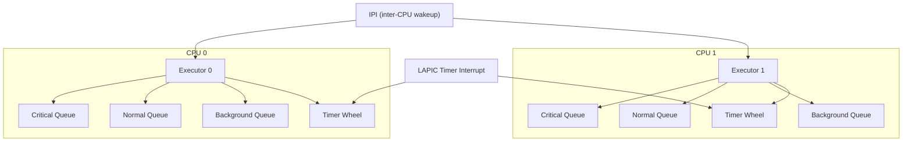
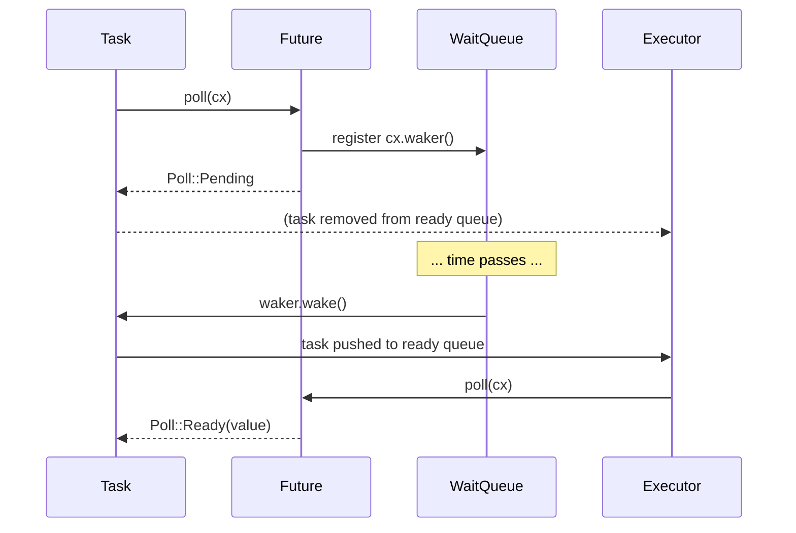
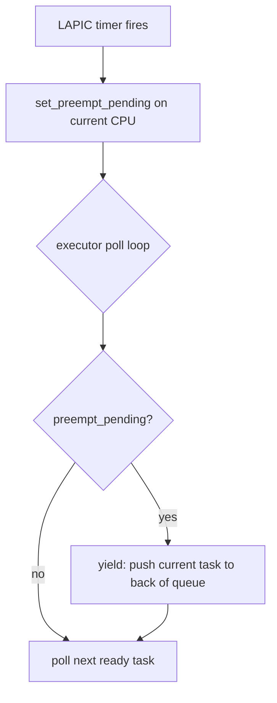

# Scheduler and Executor

Hadron's scheduling layer is implemented in the `hadron-sched` crate (`kernel/sched/`). The design is built around per-CPU async executors: each CPU runs one `Executor` instance that polls kernel tasks represented as Rust `Future<Output = ()>` objects. This maps cleanly onto kernel-mode async I/O: blocking on an IPC channel, a timer, or a hardware interrupt each becomes an `.await` point that yields the current task without suspending the CPU.

## Architecture Overview



## Per-CPU Executor

Each CPU's executor is stored in a `CpuLocal<LazyLock<Executor>>` array and initialized lazily on first access:

```rust
static EXECUTORS: CpuLocal<LazyLock<Executor>> =
    CpuLocal::new([const { LazyLock::new(Executor::new as fn() -> Executor) }; MAX_CPUS]);

pub fn global() -> &'static Executor {
    EXECUTORS.get()   // returns current CPU's executor
}

pub fn for_cpu(cpu_id: CpuId) -> &'static Executor {
    EXECUTORS.get_for(cpu_id.as_u32())
}
```

`for_cpu` is used by the waker to push a task back to the executor of the CPU that originally spawned it — preventing spurious migrations.

## Task Representation

Every kernel task is a `Pin<Box<dyn Future<Output = ()> + Send>>` stored in a `TaskEntry`:

```rust
pub struct TaskEntry {
    future: Pin<Box<dyn Future<Output = ()> + Send>>,
    meta:   TaskMeta,  // name, priority, task ID
}
```

Tasks are spawned with a globally unique `TaskId` drawn from an `AtomicU64` counter. Task IDs must be globally (not per-CPU) unique because work stealing moves tasks between executors and the destination executor must not re-use IDs from stolen tasks.

## Priority Tiers

The executor maintains three priority tiers, each backed by a separate ready queue:

| Priority | Numeric value | Intended for |
|----------|--------------|--------------|
| `Critical` | 0 (highest) | Interrupt bottom-halves, hardware event handlers |
| `Normal` | 1 | User process syscall handlers, IPC delivery |
| `Background` | 2 (lowest) | Housekeeping, statistics collection, GC |

The executor always drains `Critical` before `Normal`, and `Normal` before `Background`. A `Background` task will not run as long as any `Critical` or `Normal` task is ready.

Convenience spawn functions expose the tiers:

```rust
hadron_sched::spawn(future);                    // Normal priority
hadron_sched::spawn_critical("name", future);   // Critical priority
hadron_sched::spawn_background("name", future); // Background priority
hadron_sched::spawn_with(future, meta);         // explicit TaskMeta
```

## Waker Integration

When a task awaits an object that is not yet ready (e.g., an empty channel, a timer that hasn't fired, a semaphore at zero), the following sequence occurs:



The `Waker` implementation captures the task's `TaskId` and the `CpuId` of the spawning executor. On `wake()`, it calls `executor::for_cpu(cpu_id).enqueue(task_id)`, which pushes the task entry back into the appropriate priority tier's ready queue under an `IrqSpinLock`.

The `IrqSpinLock` on the ready queue is necessary because wakers may be called from interrupt handlers (e.g., the LAPIC timer ISR calling `timer::wake_expired()`).

## Timer Wheel

The timer subsystem (`kernel/sched/src/timer.rs`) provides deadline-based wakeups. Sleeping tasks register their `Waker` and deadline (in LAPIC ticks) in a global `IrqSpinLock<BinaryHeap<Reverse<SleepEntry>>>`:

```rust
// The heap is ordered by deadline (earliest deadline at top)
static SLEEP_QUEUE: IrqSpinLock<BinaryHeap<Reverse<SleepEntry>>> =
    IrqSpinLock::leveled("SLEEP_QUEUE", 12, BinaryHeap::new());
```

On every LAPIC timer interrupt, the interrupt handler calls `timer::wake_expired(current_tick)`. This drains expired entries from the heap in batches of up to 32, drops the lock, then calls `waker.wake()` outside the lock to avoid holding the sleep queue lock while enqueuing into the executor's ready queues (which would invert the lock order).

The `clock_nanosleep` and `event_wait_many` (with timeout) syscalls use this mechanism.

## Preemption

Hadron uses cooperative multitasking at `.await` points, with a budget-based preemption flag to prevent starvation:

```rust
static PREEMPT_PENDING: CpuLocal<AtomicBool> =
    CpuLocal::new([const { AtomicBool::new(false) }; MAX_CPUS]);
```

The LAPIC timer interrupt handler calls `set_preempt_pending()` on its CPU's flag once per tick. The executor checks this flag between task polls and inserts a yield point if it is set, ensuring no single task monopolizes a CPU across multiple ticks even if it never yields at an object boundary.



## Thread-to-Task Mapping

Each kernel `Thread` object maps one-to-one to an async task. The thread's syscall handler and blocking operations are implemented as async functions that yield at natural I/O boundaries.

When a process calls a blocking syscall (e.g., `channel_recv` on an empty channel), the kernel's syscall handler does the following:

1. Checks the channel's queue — it is empty.
2. Calls `channel.recv_async().await`, which internally calls `HeapWaitQueue::wait_until(|| !queue.is_empty()).await`.
3. The `HeapWaitFuture` registers the thread's waker and returns `Poll::Pending`.
4. The executor moves on to the next ready task.
5. When another thread writes to the channel, it calls `wake_all()` on the channel's wait queue.
6. The sleeping thread's waker fires, re-enqueuing the task.
7. On the next poll, `recv_async` finds the message and returns `Poll::Ready(message)`.
8. The syscall handler writes the message to the user buffer and returns.

This model means that blocking syscalls never consume CPU time — there is no spinning inside the kernel waiting for data.

## IPI for Cross-CPU Wakeups

When a task on CPU 0 wakes a task that is currently in the ready queue of CPU 1 (because the waking event occurred on CPU 0 while the waiting task was last run on CPU 1), the waker calls:

```
executor::for_cpu(cpu1).enqueue(task_id)  // enqueue under IrqSpinLock
send_ipi(cpu1, WAKEUP_VECTOR)             // kick CPU 1 out of HLT
```

The IPI causes CPU 1 to exit its idle `hlt` loop and re-enter the executor poll loop, where it will pick up the newly enqueued task on the next iteration.

The architecture-specific idle wait is injected via the `ArchHalt` trait:

```rust
pub trait ArchHalt {
    fn enable_interrupts_and_halt(&self);
}
```

On x86_64 this issues `sti; hlt`. The idle loop re-disables interrupts after returning from `hlt`, then re-enters the executor to check for new work.

## Thread Migration and Load Balancing (Phase 3)

Phase 3 adds work-stealing and load balancing. The design goal is:

- Tasks stay on their spawning CPU by default (cache locality).
- If a CPU's run queue is empty and another CPU has more than a threshold of ready tasks, a steal is attempted.
- Steal decisions are made at the idle entry point to avoid introducing latency on the hot path.

The `for_cpu()` accessor and globally unique `TaskId` already support this: a stolen task retains its original `TaskId` and priority, and its waker continues to push it back to the executor of the CPU that most recently ran it.

Load balancing IPIs (distinct from wakeup IPIs) are sent by the BSP's background scheduler task when per-CPU queue depth imbalances exceed a configurable threshold.

## Executor Run Loop

The executor's run loop pseudocode (from `executor.rs`):

```
loop:
  clear_preempt_pending()
  while task = dequeue_highest_priority():
    poll(task)
    if preempt_pending():
      requeue(task)
      break
  if all queues empty:
    arch_halt()  // sti; hlt — wait for next interrupt
```

The `arch_halt()` call enables interrupts atomically with the halt instruction. This prevents the lost-wakeup race where an IPI arrives after the empty-queue check but before the `hlt`.
