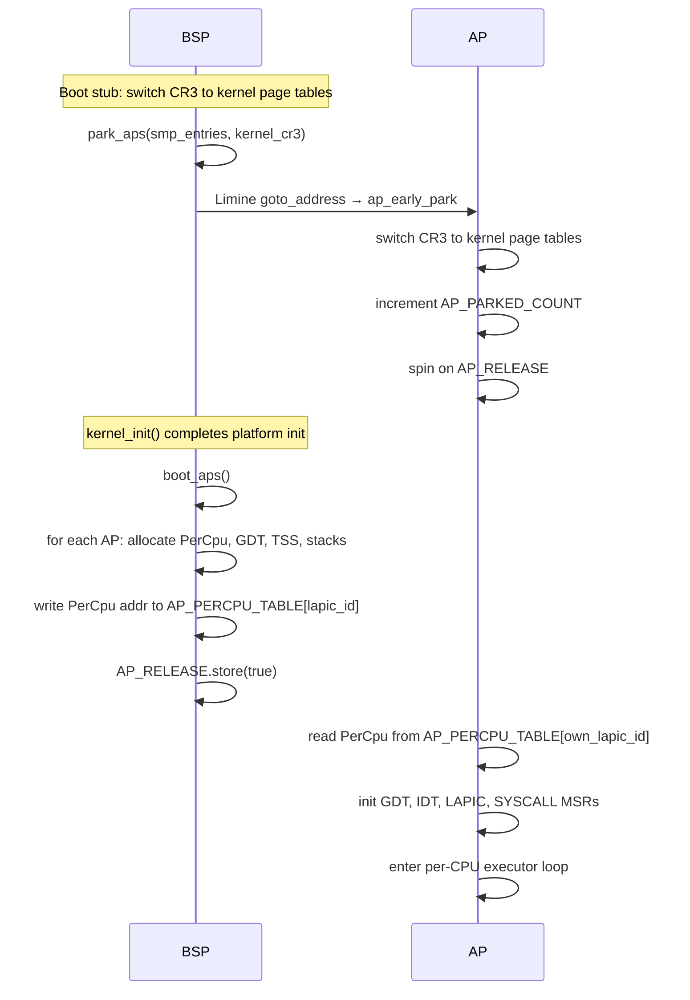
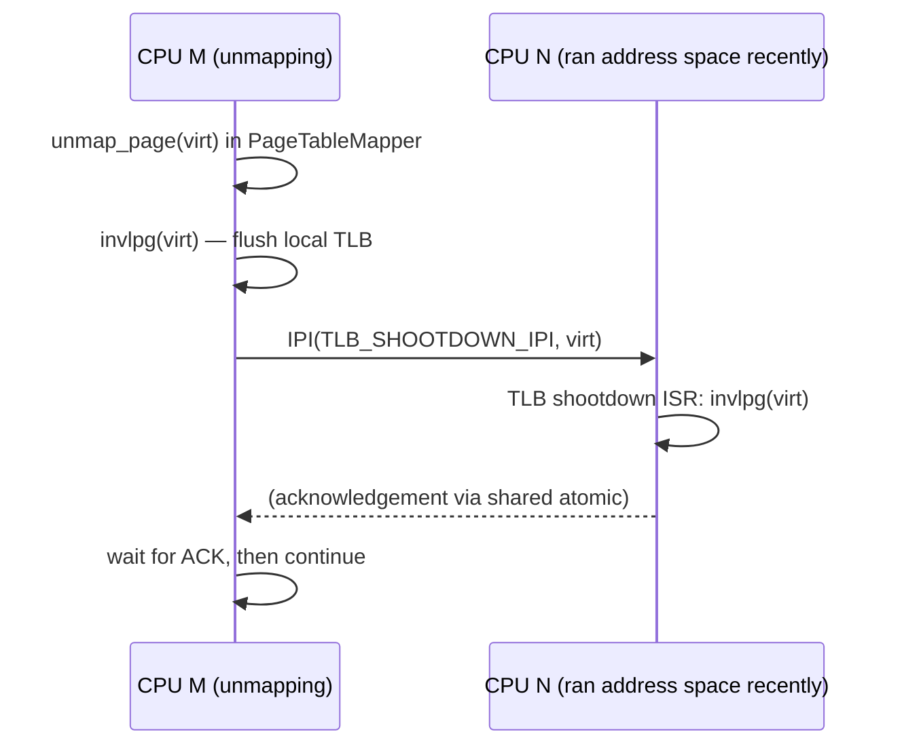
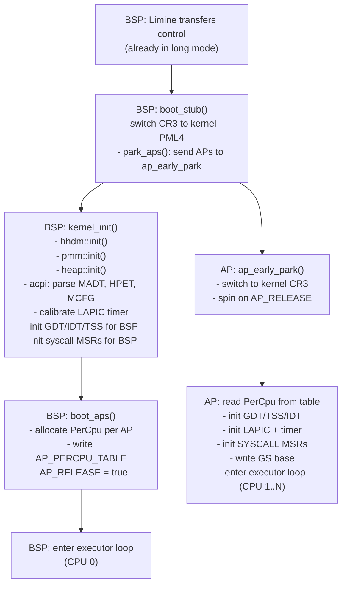

# SMP and Per-CPU State

Hadron supports symmetric multiprocessing (SMP) starting in Phase 3. One CPU — the Bootstrap Processor (BSP) — completes the full kernel initialization sequence. All other CPUs (Application Processors, APs) start up through a two-phase protocol coordinated by the BSP using Limine's SMP infrastructure and the Local APIC.

## AP Startup Protocol

AP startup uses a two-phase approach to avoid a race where APs continue executing Limine's spin loop while the BSP's kernel initialization modifies memory layouts.



### Phase 1: Parking

`park_aps()` is called immediately after the BSP switches CR3 to the kernel page tables, before `kernel_init()`. For each AP entry in the Limine SMP response, it writes the address of `ap_early_park` to Limine's `goto_address` field. This causes each AP to leave Limine's spin loop and jump to the parking trampoline.

`ap_early_park` does the minimum necessary:
1. Load `AP_KERNEL_CR3` and write it to CR3 (switch to kernel page tables).
2. Increment `AP_PARKED_COUNT`.
3. Spin on `AP_RELEASE` until it becomes `true`.

The parking phase ensures that no AP is still referencing Limine's memory mappings when the BSP proceeds to `kernel_init()` and potentially unmaps or reallocates that memory.

### Phase 2: Full Initialization

`boot_aps()` is called from `kernel_init()` after platform initialization is complete (ACPI parsed, PMM initialized, heap available). For each AP:

1. Allocate a `PerCpu` structure, kernel stack, interrupt stack, and double-fault stack on the heap.
2. Initialize the `PerCpu` structure with the AP's CPU ID, LAPIC ID, and stack pointers.
3. Store the `PerCpu` virtual address in `AP_PERCPU_TABLE[lapic_id]`.

After all `AP_PERCPU_TABLE` entries are written:

4. `AP_RELEASE.store(true, Release)` — releases all parked APs simultaneously.

Each AP reads its own entry from `AP_PERCPU_TABLE` using its LAPIC ID (obtained from the CPUID instruction or the LAPIC registers), then performs:

- **GDT setup**: installs a per-CPU GDT with a flat code/data segment and a TSS descriptor.
- **TSS setup**: writes the interrupt stack table (IST) and RSP0 (kernel stack for ring 0 entry) into the TSS.
- **IDT load**: loads the global IDT (shared with BSP, all CPUs use the same IDT).
- **LAPIC initialization**: enables the LAPIC, sets the spurious vector, and starts the LAPIC timer.
- **SYSCALL MSRs**: writes `IA32_STAR`, `IA32_LSTAR` (syscall entry point), and `IA32_FMASK`.
- **GS base**: writes the `PerCpu` virtual address to `IA32_GS_BASE` and `IA32_KERNEL_GS_BASE`.
- Enter the per-CPU executor's idle loop.

## Per-CPU State

Each CPU's state is stored in a `PerCpu` structure allocated on the kernel heap during `boot_aps()`. The GS segment base register points to this structure, enabling O(1) access to per-CPU data from any kernel context.

```rust
pub struct PerCpu {
    // Field at offset 0: self-pointer (used for safe GS-relative access)
    pub self_ptr: *mut PerCpu,
    // Field at offset 8: current task's user RSP (for syscall entry)
    pub user_rsp: u64,
    // Field at offset 16: kernel RSP for RSP0 reload on syscall entry
    pub kernel_rsp: u64,
    // Field at offset 24: this CPU's logical ID (0-based)
    pub cpu_id: u32,
    // Padding to 32 bytes
    _pad: u32,
    // ... additional fields below ...
    pub lapic_id: u32,
    pub gdt: Gdt,
    pub tss: TaskStateSegment,
    // Run queue and executor state embedded or referenced here
}
```

The `cpu_id` field at offset 24 is accessed by `hadron-core`'s `current_cpu_id()` function via an inline assembly GS-relative read:

```rust
// hadron-core/src/cpu_local.rs
#[cfg(all(target_os = "none", target_arch = "x86_64"))]
pub fn current_cpu_id() -> u32 {
    let id: u32;
    unsafe { core::arch::asm!("mov {:e}, gs:[24]", out(reg) id) };
    id
}
```

### Stacks

Each CPU has three kernel stacks:
- **RSP0 (main kernel stack)**: used on every syscall and most interrupt entries. Switched to from RSP via the `syscall` instruction's TSS RSP0 field.
- **IST1 (interrupt stack)**: used by most hardware interrupts (IRQ0–IRQ255) via the IDT's IST field.
- **IST2 (double-fault stack)**: dedicated stack for double-fault (#DF) handlers to ensure a stack-overflow fault does not become a triple fault.

### GDT and TSS

Each CPU has its own Global Descriptor Table (GDT) containing:
- Entry 0: null descriptor
- Entry 1: 64-bit kernel code (`CS` for ring 0)
- Entry 2: kernel data (`SS` for ring 0)
- Entry 3: 64-bit user code (`CS` for ring 3, used with `sysret`)
- Entry 4: user data (`SS` for ring 3)
- Entries 5–6: TSS descriptor (16 bytes, split across two entries in 64-bit mode)

The TSS holds the RSP0 and IST pointers used by the hardware on privilege-level changes.

### LAPIC Timer

Each CPU's LAPIC provides a private timer that fires periodic interrupts. The timer period is set during `boot_aps()` based on the HPET-calibrated tick rate. On every tick:

1. The timer ISR calls `hadron_sched::timer::wake_expired(current_tick)` to wake sleeping tasks.
2. The ISR calls `hadron_sched::set_preempt_pending()` to trigger a preemption check.
3. The ISR acknowledges the LAPIC by writing to the EOI register.

### Run Queue

Each CPU's executor instance (`EXECUTORS.get()`) is lazily initialized on first access. The executor's ready queues are protected by `IrqSpinLock` to allow wakers to enqueue from interrupt context.

## CpuLocal Storage

`CpuLocal<T>` (from `hadron-core`) provides per-CPU access to global data without requiring GS-relative pointer arithmetic at every call site. It is an array indexed by `current_cpu_id()`:

```rust
static PREEMPT_PENDING: CpuLocal<AtomicBool> =
    CpuLocal::new([const { AtomicBool::new(false) }; MAX_CPUS]);

// Accesses the current CPU's AtomicBool
PREEMPT_PENDING.get().store(true, Ordering::Release);
```

All `CpuLocal` statics are `const`-initialized, making them valid before any CPU runs initialization code.

## IPI Mechanisms

Inter-Processor Interrupts (IPIs) are sent via the BSP's or any CPU's LAPIC ICR (Interrupt Command Register). Hadron uses three IPI vectors:

| Vector | Name | Purpose |
|--------|------|---------|
| `WAKEUP_IPI` | Executor wakeup | Wake a CPU from HLT after enqueuing a task |
| `TLB_SHOOTDOWN_IPI` | TLB shootdown | Invalidate a virtual address on remote CPUs |
| `RESCHEDULE_IPI` | Rebalance hint | Signal a CPU to check for work-stealing opportunities |

### Cross-CPU Task Wakeup

When a waker fires for a task that was spawned on CPU N but the waker is executing on CPU M:

```
executor::for_cpu(N).enqueue(task)   // enqueue under IrqSpinLock
lapic::send_ipi(N, WAKEUP_IPI)       // kick CPU N out of HLT
```

CPU N's WAKEUP_IPI handler simply acknowledges the LAPIC (writes EOI) and returns. The return from the ISR causes the CPU to re-enter the executor poll loop, which finds the newly enqueued task.

### TLB Shootdown

When a mapping is removed from a user address space and that address space may be cached in remote TLBs:



The current CPU must not touch the unmapped virtual address until all remote TLBs have been invalidated. In practice, the kernel ensures this by completing the shootdown before returning from the syscall that requested the unmap.

### Scheduler Rebalancing (Phase 3)

`RESCHEDULE_IPI` is sent by a CPU that has tasks to donate (work-stealing push) or by the BSP's background balancer task. The receiving CPU checks whether its queue depth is below threshold and, if so, attempts to steal from the sender's queue.

## CPU Identification

`CpuId` in `hadron-core` is a newtype around `u32`. The BSP is always CPU 0. APs are numbered 1 through N-1 in the order they appear in the MADT and complete Phase 2 initialization.

LAPIC IDs (as reported by CPUID leaf 1 or the MADT) are hardware identifiers that may not be contiguous and may exceed N-1. The kernel maintains a mapping from LAPIC ID to logical CPU ID in a static lookup table initialized during `boot_aps()`.

```rust
pub struct CpuId(u32);

impl CpuId {
    pub fn as_u32(self) -> u32 { self.0 }
    pub fn current() -> Self { CpuId(current_cpu_id()) }
}
```

## Complete SMP Boot Timeline



The parallel executor loops on all CPUs wait for tasks in HLT and are woken by IPIs when new work arrives.
