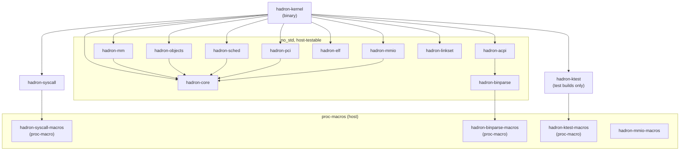

# File Tree

This page documents the complete crate structure of the Hadron project. Each directory is annotated with its purpose and the status of its content relative to the legacy framekernel.

Legend:
- **New**: written from scratch for the object microkernel.
- **Adapted**: based on legacy code but significantly reworked.
- **Legacy**: carried over largely unchanged from the framekernel.

---

## Project Root

```
hadron/
  Cargo.toml          # Workspace manifest; lists all crate members and shared dependencies
  Cargo.lock          # Pinned dependency versions for reproducible builds
  gluon.rhai          # Build system configuration (Rhai DSL for gluon)
  gluon.lock          # Pinned gluon/dependency versions
  Kconfig             # Top-level Kconfig; includes subsystem Kconfig files
  justfile            # Just task runner; wraps gluon commands
  rust-project.json   # rust-analyzer project descriptor (generated by `just configure`)
  rust-toolchain.toml # Pinned nightly toolchain version
  _typos.toml         # typos spell-checker configuration
  targets/            # Custom Rust target JSON specifications
  vendor/             # Vendored external crate sources (managed by `just vendor`)
  toolchain/          # Rust sysroot sources (core, alloc, compiler_builtins)
  build/              # Build output (kernel images, initrd, ELF binaries)
  docs/               # mdbook documentation
```

---

## targets/

Target JSON specifications for the custom Rust targets. Each file is passed to `cargo` as `--target`.

```
targets/
  x86_64-unknown-hadron.json       # Kernel target: softfloat, kernel code model,
                                   #   no red zone, panic=abort, PIC relocation
  x86_64-unknown-hadron-user.json  # Userspace target: standard sysv64 ABI,
                                   #   links against hadron-libc
  x86_64-unknown-hadron.ld        # Linker script for x86_64 kernel
  aarch64-unknown-hadron.json      # AArch64 kernel target (future porting work)
  aarch64-unknown-hadron.ld       # Linker script for AArch64 kernel
```

All three target specs are **New** — there were no custom targets in the legacy framekernel.

---

## kernel/

All code that runs in ring 0. Organized as a collection of focused crates rather than a monolith.

```
kernel/
  core/       # hadron-core: shared primitives used by all kernel crates
  intrinsics/ # hadron-intrinsics: compiler intrinsics shims
  kernel/     # hadron-kernel: main kernel binary (arch code, subsystems, init)
  mm/         # hadron-mm: memory management (PMM, VMM, page mapper, heap)
  mmio/       # hadron-mmio: type-safe MMIO register access
  mmio-macros/# hadron-mmio-macros: proc-macro for mmio register definitions
  objects/    # hadron-objects: kernel object system (KernelObject, handles, rights)
  pci/        # hadron-pci: PCIe enumeration and ECAM config space access
  sched/      # hadron-sched: per-CPU async executor, timer, waker
  syscall/    # hadron-syscall: syscall number definitions and ABI types
  syscall-macros/ # hadron-syscall-macros: define_syscalls! proc-macro
```

### kernel/core/ — hadron-core [New]

The foundational crate. Depended upon by every other kernel crate. Contains only `no_std`-compatible, host-testable code.

```
kernel/core/src/
  lib.rs            # Crate root; re-exports all public modules
  addr.rs           # PhysAddr and VirtAddr newtypes with alignment helpers
  alt_fn.rs         # AtomicFn: atomically swappable function pointer
  alt_instr.rs      # Alternative instruction patching infrastructure (SMP opt-in)
  cell.rs           # SyncUnsafeCell: UnsafeCell with Send+Sync for lock internals
  cpu_features.rs   # CpuFeatures bitflags (RDTSCP, FSGSBASE, XSAVE, etc.)
  cpu_local.rs      # CpuLocal<T>: per-CPU storage indexed by CPU ID
  id.rs             # CpuId, Koid (kernel object ID) newtypes
  mem.rs            # Utility functions: align_up, align_down, is_aligned
  paging.rs         # Page, PhysFrame, PageSize trait, Size4KiB/2MiB/1GiB
  safety.rs         # assert_unsafe_precondition! macro for debug safety checks
  sched.rs          # ReadyQueues: priority-tiered task queue shared with hadron-sched
  static_assert.rs  # const_assert! macro for compile-time assertions
  task.rs           # TaskId, TaskMeta, Priority enum (Critical/Normal/Background)
  sync/
    mod.rs          # Sync module root; re-exports all primitives
    atomic.rs       # AtomicPtr, AtomicU32, AtomicU64, AtomicBool wrappers
    atomic_fn.rs    # AtomicFn: atomic function pointer swap
    backend.rs      # Backend / IrqBackend traits; CoreBackend, LoomBackend, ShuttleBackend
    cell.rs         # SyncUnsafeCell definition
    condvar.rs      # Condvar: async condition variable
    heap_waitqueue.rs # HeapWaitQueue: heap-allocated wait queue for object signals
    irq_spinlock.rs # IrqSpinLock: spinlock that disables interrupts
    lazy.rs         # LazyLock: one-shot lazy initialization
    lockdep.rs      # Runtime lock dependency tracking (cfg(hadron_lockdep))
    loom_mock.rs    # Loom thread-local stubs for IrqBackend (cfg(loom))
    mutex.rs        # Mutex: async-aware mutex backed by WaitQueue
    rwlock.rs       # RwLock: reader-writer lock
    semaphore.rs    # Semaphore: counting semaphore with async acquire
    seqlock.rs      # SeqLock: sequence lock for read-mostly Copy data
    shuttle_mock.rs # Shuttle stubs (cfg(shuttle))
    spinlock.rs     # SpinLock: TTAS spinlock with lockdep integration
    stress.rs       # Lock stress test harness (cfg(hadron_lock_stress))
    waitqueue.rs    # WaitQueue: intrusive waker list for async primitives
    test_waker.rs   # Test waker implementation for unit tests (cfg(test))
```

### kernel/intrinsics/ — hadron-intrinsics [Legacy/Adapted]

Shims for compiler intrinsics that are not available in `no_std` without the standard library (e.g., `memcpy`, `memset`, `memcmp`). These are required because `compiler_builtins` is built from source for the custom target.

```
kernel/intrinsics/src/
  lib.rs   # Provides __aeabi_* and mem* intrinsics
```

### kernel/kernel/ — hadron-kernel [New]

The main kernel binary. Contains the entry point, architecture-specific initialization, hardware drivers, syscall dispatch, and subsystem glue. This is the crate that becomes the kernel ELF.

```
kernel/kernel/src/
  lib.rs                      # Kernel entry point (kernel_init), global init sequence
  arch/
    mod.rs                    # Architecture dispatch (selects x86_64 or aarch64 impl)
    x86_64/
      mod.rs                  # x86_64 module root; platform init sequence
      acpi.rs                 # ACPI platform init: parse MADT, HPET, MCFG, DMAR
      alt_fn.rs               # x86_64 AtomicFn / alternative instruction support
      alt_instr.rs            # SMP-aware alternative instruction patching
      cpuid.rs                # CPUID leaf queries; CpuFeatures detection
      fpu.rs                  # FPU/SSE context save/restore for user threads
      gdt.rs                  # GDT construction and per-CPU TSS setup
      idt.rs                  # IDT construction; exception/IRQ vector registration
      legacy.rs               # Legacy 8259 PIC disable sequence
      mem.rs                  # x86_64 memory init: CR3 setup, HHDM confirmation
      smp.rs                  # AP parking (park_aps) and full init (boot_aps)
      syscall.rs              # SYSCALL/SYSRET entry stub; MSR configuration
      userspace.rs            # Ring 3 entry (sysret); signal frame management
      hw/
        mod.rs                # Hardware driver module root
        hpet.rs               # HPET MMIO driver; timer calibration
        io_apic.rs            # I/O APIC programming; GSI → IRQ vector mapping
        local_apic.rs         # LAPIC MMIO driver; timer, IPI, EOI
        pic.rs                # Legacy 8259A PIC driver (disable sequence)
        pit.rs                # Legacy 8253/8254 PIT driver (calibration fallback)
        rtc.rs                # Real-time clock driver
        tsc.rs                # TSC frequency measurement and rdtsc wrappers
      instructions/
        mod.rs
        interrupts.rs         # sti, cli, pushfq/popfq wrappers
        port.rs               # inb/outb/inw/outw/inl/outl I/O port wrappers
        segmentation.rs       # lgdt, ltr, lidt, load_cs wrappers
        tables.rs             # sgdt, sidt wrappers
        tlb.rs                # invlpg, write_cr3, read_cr3 wrappers
      interrupts/
        mod.rs                # Interrupt subsystem root
        dispatch.rs           # IRQ dispatch table; handler registration API
        exception_table.rs    # CPU exception handlers (#PF, #GP, #DF, #SS, etc.)
        handlers.rs           # Hardware IRQ handlers (timer, spurious, IPI vectors)
        timer_stub.rs         # LAPIC timer ISR: tick counter, preemption, sleep wakeups
      paging/
        mod.rs                # x86_64 paging module root
        mapper.rs             # PageTableMapper: walks/builds page tables via HHDM
      registers/
        mod.rs
        control.rs            # CR0, CR3, CR4, EFER read/write
        model_specific.rs     # MSR read/write; IA32_GS_BASE, IA32_KERNEL_GS_BASE,
                              #   IA32_STAR, IA32_LSTAR, IA32_FMASK
        rflags.rs             # RFLAGS read/write
      structures/
        mod.rs
        gdt.rs                # GDT and segment descriptor types
        idt.rs                # IDT gate descriptor types
        machine_state.rs      # SavedRegisters: full GPR save/restore frame
        paging.rs             # PageTable, PageTableEntry, PageTableFlags
    aarch64/
      mod.rs                  # AArch64 platform stub (future porting work)
      interrupts.rs           # GIC interrupt stubs
      paging/mod.rs           # AArch64 page table stubs
      instructions/mod.rs     # AArch64 instruction wrappers
```

### kernel/mm/ — hadron-mm [New]

Architecture-independent memory management. Host-testable — no kernel-only dependencies.

```
kernel/mm/src/
  lib.rs           # Crate root; FrameAllocator/FrameDeallocator traits, PAGE_SIZE, zero_frame()
  address_space.rs # AddressSpace<M>: per-process PML4; kernel upper-half sharing; Drop frees PML4
  heap.rs          # Kernel heap allocator initialization; GlobalAlloc impl
  hhdm.rs          # HHDM_OFFSET global; init(), phys_to_virt(), virt_to_phys()
  layout.rs        # Virtual address space layout constants (HHDM base, kernel heap range, etc.)
  mapper.rs        # MapFlags, MapFlush, PageMapper<S> trait, PageTranslator trait,
                   #   register_tlb_flush() callback
  pmm.rs           # Physical memory manager: zone-based buddy allocator
  region.rs        # MemoryRegion: typed physical memory region (Usable, Reserved, ACPI, etc.)
  vmm.rs           # VmmError, high-level virtual memory operations
  zone.rs          # MemoryZone: a contiguous physical range managed by the PMM
```

### kernel/mmio/ and kernel/mmio-macros/ — hadron-mmio [New]

Type-safe MMIO register access. Prevents bit-field bugs by generating typed accessor methods from a declarative register map.

```
kernel/mmio/src/
  lib.rs       # MmioRegister<T>: volatile read/write with memory barriers

kernel/mmio-macros/src/
  lib.rs       # proc-macro entry point
  parse.rs     # Parse register map DSL (register_block! macro input)
  codegen.rs   # Generate typed register struct with read()/write()/modify() methods
```

Used by `hw/local_apic.rs`, `hw/io_apic.rs`, and `hw/hpet.rs` for safe register access.

### kernel/objects/ — hadron-objects [New]

The kernel object system. All kernel resources are `Arc<dyn KernelObject>` values accessed through a per-process handle table.

```
kernel/objects/src/
  lib.rs       # Crate root; module declarations
  object.rs    # KernelObject trait: koid(), type_name(), signals(), on_zero_handles()
               # Koid: globally unique u64 kernel object ID
               # Signals: bitflags for object-readable/writable/closed/etc. state
  handle.rs    # HandleTable: per-process table of (fd → Arc<dyn KernelObject> + Rights)
               # Rights: capability bitflags (READ, WRITE, EXECUTE, MAP, SIGNAL, DUPLICATE, ...)
               # HandleEntry: one table row
  process.rs   # Process: address space, handle table, exit status, parent PID
  thread.rs    # Thread: async task handle, user register context, signal state, TID
  vmar.rs      # Vmar: virtual memory address region; range tree of committed mappings
  vmo.rs       # Vmo: virtual memory object; physical frame backing, commit bitmap
```

### kernel/pci/ — hadron-pci [Adapted]

PCIe enumeration using ECAM (memory-mapped configuration space). Host-testable.

```
kernel/pci/src/
  lib.rs        # Crate root; PciBus, PciDevice, PciFunction types
  enumerate.rs  # Walk MCFG ECAM regions; enumerate buses, devices, functions
  regs.rs       # PCI configuration space register offsets and field masks
  caps.rs       # PCI capability list parser (MSI, MSI-X, PCIe, etc.)
  types.rs      # BusDevFunc, DeviceId, ClassCode, BarType, etc.
  tests.rs      # Unit tests for enumeration logic
```

### kernel/sched/ — hadron-sched [New]

Per-CPU async executor and kernel task scheduling.

```
kernel/sched/src/
  lib.rs         # Crate root; spawn(), spawn_critical(), spawn_background(), spawn_with()
                 # PREEMPT_PENDING: CpuLocal<AtomicBool>
                 # set_preempt_pending(), preempt_pending(), clear_preempt_pending()
  executor.rs    # Executor: per-CPU task runner; priority queues; ArchHalt trait
                 # EXECUTORS: CpuLocal<LazyLock<Executor>>
                 # NEXT_TASK_ID: AtomicU64 (globally unique task IDs)
                 # global(), for_cpu(cpu_id)
  timer.rs       # SLEEP_QUEUE: IrqSpinLock<BinaryHeap<Reverse<SleepEntry>>>
                 # register_sleep_waker(deadline, waker)
                 # wake_expired(current_tick): drain expired wakers (max 32/tick)
  waker.rs       # KernelWaker: stores TaskId + CpuId; wake() pushes to executor queue
  primitives.rs  # yield_now(): cooperatively yield the current task
```

### kernel/syscall/ — hadron-syscall [New]

Single source of truth for all syscall definitions. Generates both kernel dispatch tables and userspace ABI stubs.

```
kernel/syscall/src/
  lib.rs   # define_syscalls! macro invocation; defines:
           #   - SYS_* number constants
           #   - E* error code constants
           #   - #[repr(C)] shared types (Timespec, SpawnInfo, PollFd, StatInfo, ...)
           #   - Named constants (PROT_*, MAP_*, OPEN_*, SEEK_*, F_*, SIG_*, POLL*, ...)
           #   - Syscall groups (task, handle, channel, vnode, memory, event, net, system)
           #   - (feature "kernel") SyscallHandler trait + dispatch()
           #   - (feature "userspace") Raw syscallN asm stubs + typed wrappers
```

### kernel/syscall-macros/ — hadron-syscall-macros [New]

The `define_syscalls!` proc-macro that processes the syscall DSL in `hadron-syscall`.

```
kernel/syscall-macros/src/
  lib.rs        # proc-macro crate entry point
  model.rs      # SyscallDef, GroupDef, ErrorDef, TypeDef, ConstDef data model
  parse.rs      # Parse the define_syscalls! DSL into the model
  validate.rs   # Validate: no duplicate numbers, no overlapping groups, valid types
  gen_common.rs # Generate: SYS_* constants, E* constants, shared types, Syscall enum
  gen_kernel.rs # Generate: SyscallHandler trait, dispatch() match arm
  gen_userspace.rs # Generate: raw syscallN asm stubs, typed wrapper functions
```

---

## crates/

Library crates that are not part of the kernel binary itself. Organized by category.

### crates/boot/

```
crates/boot/
  uefi/          # hadron-uefi: UEFI protocol bindings
    src/
      lib.rs       # Re-exports all UEFI types
      guid.rs      # UEFI GUID type and common protocol GUIDs
      memory.rs    # UEFI memory map types and descriptors
      status.rs    # UEFI Status code type
      table.rs     # System Table, Boot Services, Runtime Services structs
      api/         # Protocol implementations (Graphics Output, File System, etc.)
      protocol/    # UEFI protocol interface definitions
```

`hadron-uefi` is **Adapted** from the legacy UEFI bindings, extended with additional protocols needed for the Limine boot path.

### crates/core/

```
crates/core/
  linkset/       # hadron-linkset: linker section registration
    src/
      lib.rs     # linkset! and #[linkset_entry] macros; used for ktest registration,
                 #   driver registration, and alternative instruction tables
```

`hadron-linkset` is **New**. It enables the `#[ktest]` and driver registration patterns without requiring a global mutable registry.

### crates/parse/

Standalone, `no_std` parser crates. All are host-testable.

```
crates/parse/
  acpi/          # hadron-acpi: ACPI table parser (see Internals / ACPI chapter)
    src/
      lib.rs       # AcpiTables, AcpiHandler, AcpiError; re-exports all table types
      rsdp.rs      # RSDP validation and version detection
      rsdt.rs      # RSDT/XSDT iteration; MatchingTableIter
      sdt.rs       # SdtHeader, ValidatedTable, load_table(), checksum validation
      madt.rs      # MADT: CPU/LAPIC/IOAPIC topology; MadtEntry variants
      dmar.rs      # DMAR: VT-d remapping hardware; DmarEntry, DeviceScope
      mcfg.rs      # MCFG: PCIe ECAM regions; McfgEntry
      hpet.rs      # HPET: high-precision timer table
      fadt.rs      # FADT: fixed ACPI description (DSDT pointer, PM timer)
      srat.rs      # SRAT: NUMA affinity (System Resource Affinity Table)
      slit.rs      # SLIT: NUMA distance (System Locality Information Table)
      ivrs.rs      # IVRS: AMD IOMMU reporting structure
      bgrt.rs      # BGRT: boot graphics resource table (firmware splash)
      resource.rs  # AcpiResource iterator for _CRS evaluation results
      aml/         # AML bytecode walker and namespace builder

  binparse/      # hadron-binparse: byte-slice parsing primitives
    src/
      lib.rs     # FromBytes derive-able trait; TableEntries iterator;
                 #   read_at(), read_slice_at() helpers

  binparse-macros/ # hadron-binparse-macros: #[derive(FromBytes)] proc-macro
    src/
      lib.rs     # Derives FromBytes for #[repr(C)] structs

  dwarf/         # hadron-dwarf: DWARF debug info parser (host tool use only)
    src/
      lib.rs     # Used by hadron-perf for symbolizing kernel stack traces

  elf/           # hadron-elf: ELF64 parser for loading userspace binaries
    src/
      lib.rs     # ElfHeader, ProgramHeader, SectionHeader; load_segments()

  fdt/           # hadron-fdt: Flattened Device Tree parser (AArch64 hardware discovery)
    src/
      lib.rs     # FdtHeader, FdtNode iteration; for AArch64 AP bringup
```

All parse crates are **New**. The legacy kernel used ad-hoc parsing with no abstraction.

### crates/test/

Test infrastructure crates. Not included in release kernel builds.

```
crates/test/
  hadron-bench/        # Benchmark framework for kernel micro-benchmarks
    src/
      lib.rs           # BenchSuite, bench_fn!, timing infrastructure

  hadron-ktest/        # Kernel integration test runner
    src/
      lib.rs           # KtestEntry: registered test functions (via linker section)
                       # run_all_tests(): enumerate entries, run each, report to serial

  hadron-ktest-macros/ # #[ktest] attribute proc-macro
    src/
      lib.rs           # #[ktest] -> generate KtestEntry in .ktest linker section

  hadron-test/         # Shared test utilities (host + kernel)
    src/
      lib.rs           # Test helpers: assert_page_aligned!, memory region builders

  hadron-utest/        # Userspace test runner (for Phase 5+ integration tests)
    src/
      lib.rs           # Spawns test processes and collects results via Channel IPC
```

### crates/tools/

Host-side tooling. Compiled for the build host, not for the kernel target.

```
crates/tools/
  gluon/          # The gluon build system itself
    src/
      main.rs     # CLI entry point; subcommand dispatch
      ...         # Rhai evaluator, cargo driver, QEMU launcher, vendor resolver,
                  #   Kconfig processor, rust-project.json emitter

  hadron-perf/    # Performance analysis tool for kernel traces
    src/
      main.rs     # Reads perf ring buffer from QEMU shared memory;
                  #   symbolizes with hadron-dwarf; outputs flamegraph data
```

`gluon` is **New** — the legacy kernel used a shell script and `cargo` directly.

---

## userspace/

Userspace libraries and runtime. Compiled for `x86_64-unknown-hadron-user`.

```
userspace/
  hadron-libc/         # C standard library implementation for Hadron
    core/              # Core libc (compiled into Cargo workspace)
      src/
        lib.rs         # Syscall wrappers: wraps hadron-syscall userspace stubs
                       #   into POSIX function signatures (read, write, open, etc.)
    src/               # Additional libc modules (compiled by gluon separately)
      ...

  lepton-syslib/       # Higher-level Hadron userspace runtime
    src/
      lib.rs           # C++ ABI support, thread-local storage, dynamic linker interface
      ...
```

`hadron-libc` is **New** — the legacy kernel had no userspace. `lepton-syslib` is also **New**, providing the runtime glue layer between the kernel's capability model and the POSIX interface expected by applications.

---

## docs/

mdbook documentation source.

```
docs/
  book.toml            # mdbook configuration (preprocessors, theme, output)
  mermaid.min.js       # Bundled Mermaid.js for diagram rendering
  mermaid-init.js      # Mermaid initialization script
  src/
    SUMMARY.md         # mdbook table of contents (chapter structure)
    introduction.md    # Project introduction and goals
    architecture/      # High-level architecture chapters
      overview.md
      object-model.md
      handle-system.md
      ipc.md
      memory.md
      process-thread.md
      crate-structure.md
    design/            # Design decision documents
      boot-procedure.md
      syscall-interface.md
      vfs-routing.md
      iommu.md
      capabilities.md
      driver-architecture.md
      memory-layout.md
    internals/         # Implementation internals (this section)
      synchronization.md
      scheduler.md
      page-tables.md
      acpi.md
      smp.md
    reference/         # Reference material
      build-system.md
      phases.md
      syscall-reference.md
      file-tree.md
  book/                # Generated HTML output (committed for GitHub Pages)
  plans/               # Internal planning documents (not published)
```

---

## Dependency Graph Summary



All crates in the "no_std, host-testable" group compile on the host for unit testing without QEMU. Only `hadron-kernel` itself requires the custom target and cannot be compiled for the host.
