# Implementation Phases

Hadron's development is organized into six sequential phases. Each phase adds a coherent set of kernel capabilities and has a concrete verification criterion — a user-visible behavior that demonstrates the phase is complete. Phases build strictly on the previous ones: Phase N is not started until Phase N-1's verification criterion passes.

```mermaid
gantt
    title Hadron Implementation Phases
    dateFormat X
    axisFormat Phase %s

    section Phase 1
    Foundation (kernel boots, enters usermode) :p1, 0, 1

    section Phase 2
    IPC (channels, ports, events) :p2, 1, 2

    section Phase 3
    SMP + Scheduling :p3, 2, 3

    section Phase 4
    IOMMU + Device Support :p4, 3, 4

    section Phase 5
    VFS + Userspace Servers :p5, 4, 5

    section Phase 6
    Userspace Ecosystem :p6, 5, 6
```

## Phase 1: Foundation

**Goal**: Kernel boots via UEFI, sets up all machine-level abstractions, and runs the first userspace process.

### Kernel Subsystems

| Component | Description |
|-----------|-------------|
| UEFI boot stub (`kernel/boot/`) | Limine-based bootloader that hands off to `kernel_init()` with a `BootInfo` struct |
| GDT | Per-CPU Global Descriptor Table with flat 64-bit segments and TSS |
| IDT | Interrupt Descriptor Table: CPU exceptions (#PF, #GP, #DF, etc.) and hardware IRQs |
| SYSCALL entry | `syscall`/`sysret` fast path; saves/restores user registers |
| PMM | Physical Memory Manager: buddy allocator over memory map regions provided by Limine |
| VMM | Virtual Memory Manager: page table operations, kernel heap mapping |
| Kernel heap | `linked_list_allocator` or similar slab allocator; enables `Box`, `Vec`, `Arc` in kernel |
| ACPI parsing | RSDP → MADT → CPU topology (LAPIC IDs) for single-CPU bringup |
| `KernelObject` trait | Base trait for all kernel objects: `koid()`, `type_name()`, signal support |
| `Koid` | Kernel object ID: globally unique u64, monotonically increasing |
| `HandleTable` | Per-process table mapping file descriptor numbers to `Arc<dyn KernelObject>` + rights bitmask |
| `Rights` | Bitflags for capability enforcement: READ, WRITE, EXECUTE, MAP, SIGNAL, etc. |
| `Process` object | Address space, handle table, exit status |
| `Thread` object | Kernel task, user register context, signal state |
| `Vmar` object | Virtual memory address region: maps VMOs into a process's address space |
| `Vmo` object | Virtual memory object: anonymous physical memory, size, commit bitmap |
| `task_exit` | Terminates the current process |
| `debug_log` | Writes a string to the kernel serial console (for early debugging) |
| `mem_map` / `mem_unmap` | Anonymous memory mapping/unmapping |
| `mem_brk` | Program break adjustment (heap expansion for userspace malloc) |

### Verification Criterion

Userboot (the first userspace binary) prints the string `Hello from userspace` to the serial port. This requires:
- UEFI boot and kernel entry functioning.
- PMM and heap allocator providing working allocation.
- Page tables mapping the kernel and the userboot ELF.
- VMAR/VMO mapping the userboot stack and text/data segments.
- SYSCALL entry and `debug_log` syscall implementation.
- A working ring 3 `sysret` to the userboot entry point.

## Phase 2: IPC

**Goal**: Processes can communicate, transfer handles, and receive asynchronous notifications.

### Kernel Objects

| Object | Description |
|--------|-------------|
| `Channel` | Bidirectional message queue; messages are up to 4096 bytes with optional handle attachments |
| `Port` | Message aggregator; receives `PortPacket` notifications from multiple kernel objects |
| `Event` | Manual-reset signaling object; userspace can signal and wait on it |
| `EventPair` | Linked pair of `Event` objects; signaling one wakes waiters on both |
| `Timer` | One-shot or repeating timer that fires at a deadline |
| `Fifo` | High-throughput fixed-size message queue for data-plane IPC |

### Syscalls

| Syscall | Group | Description |
|---------|-------|-------------|
| `channel_create` | channel | Create a bidirectional channel pair; returns two fds |
| `channel_send` | channel | Send a message (bytes) on a channel endpoint |
| `channel_recv` | channel | Receive a message from a channel endpoint |
| `channel_send_fd` | channel | Send a message with an attached file descriptor |
| `channel_recv_fd` | channel | Receive a message and its attached file descriptor |
| `channel_accept` | channel | Accept a connection from a service listener |
| `handle_close` | handle | Close a file descriptor |
| `handle_dup` | handle | Duplicate a fd to a specific number (dup2 semantics) |
| `handle_dup_lowest` | handle | Duplicate a fd to the lowest available number |
| `handle_pipe` | handle | Create a unidirectional pipe (read fd + write fd) |
| `event_wait_many` | event | Poll multiple fds for readiness (with timeout) |
| `clock_gettime` | event | Read the monotonic or real-time clock |
| `clock_nanosleep` | event | Sleep for a specified duration |
| `futex` | event | Fast userspace mutex (FUTEX_WAIT/FUTEX_WAKE) |

### Verification Criterion

Two userspace processes communicate over a `Channel`:
1. Process A creates a channel pair `(fd_a, fd_b)`.
2. Process A spawns Process B, passing `fd_b` via `task_spawn` fd inheritance.
3. Process A sends a handle (e.g., a `Vmo`) and a message over `fd_a` using `channel_send_fd`.
4. Process B receives the message and handle via `channel_recv_fd`.
5. Process B reads from the VMO through the received handle.
6. Both processes exit cleanly.

Additionally, a `Port` aggregates `READABLE` signals from multiple channels, demonstrating that `event_wait_many` and port-based I/O multiplexing work.

## Phase 3: SMP + Scheduling

**Goal**: All CPUs are running, the scheduler preempts tasks fairly, and cross-CPU wakeups work.

### Components

| Component | Description |
|-----------|-------------|
| AP startup | INIT-SIPI-SIPI sequence via Limine; two-phase park/init protocol |
| Per-CPU executor | Each CPU runs its own `hadron-sched` executor with Critical/Normal/Background queues |
| Priority preemption | LAPIC timer sets `PREEMPT_PENDING`; executor yields current task at tick boundary |
| IPI: wakeup | `WAKEUP_IPI` kicks a CPU out of HLT when a task is enqueued remotely |
| IPI: TLB shootdown | `TLB_SHOOTDOWN_IPI` invalidates virtual addresses on remote CPUs |
| Thread migration | Work-stealing: idle CPUs steal tasks from overloaded CPUs |
| Load balancing | Background task monitors per-CPU queue depths and rebalances |

### Verification Criterion

- N CPUs (N ≥ 2) are all running user threads concurrently (verified via per-CPU counter increments visible in the `query` syscall response).
- A high-priority thread preempts a low-priority thread on the same CPU within one timer tick.
- A thread blocked on a `Channel` on CPU 0 is woken by a message sent from CPU 1 within the IPI delivery latency budget.

## Phase 4: IOMMU + Device Support

**Goal**: Userspace drivers can perform safe DMA through IOMMU-confined buffers, and PCIe device interrupts are delivered to userspace.

### Components

| Component | Description |
|-----------|-------------|
| VT-d initialization | Parse DMAR table; map IOMMU MMIO registers; enable DMA remapping |
| `Iommu` object | Represents one VT-d DRHD unit |
| `Bti` object | Bus Transaction Initiator: scoped DMA capability for one PCI function |
| `Pmt` object | Pinned Memory Token: a specific physical buffer pinned for DMA by a `Bti` |
| `Interrupt` object | Represents one hardware interrupt line; can be waited on via `event_wait_many` |
| PCI enumeration | Walk MCFG ECAM; discover devices, read BAR addresses, allocate MSI-X vectors |
| `Resource` capability | Wraps a PCI BAR (MMIO range) that a driver process may map |

### Verification Criterion

A userspace `virtio-blk` driver:
1. Receives a `Resource` capability for the VirtIO PCI device's MMIO BAR.
2. Obtains a `Bti` for the device's PCI function.
3. Creates a `Pmt` to pin a `Vmo` for DMA.
4. Programs the VirtIO queue descriptor with the IOVA from the `Pmt`.
5. Issues a read request to the virtual disk.
6. Receives the completion interrupt via an `Interrupt` object.
7. Returns the sector data to the test process.

All DMA occurs within the IOMMU-defined address window — the device cannot access memory outside the `Pmt`.

## Phase 5: VFS + Userspace Servers

**Goal**: A mountable filesystem is accessible from userspace through standard path-based operations.

### Components

| Component | Description |
|-----------|-------------|
| VFS routing layer | Kernel-side mount table; routes `vnode_open` paths to the owning FS server via Channel |
| `userboot` | First userspace process; sets up the initial namespace and launches `devmgr` |
| `devmgr` | Device manager; manages the device tree and launches driver hosts |
| `driver-host` | Isolation process for hardware drivers |
| First driver | Minimal driver (e.g., UART or VirtIO console) registered via `devmgr` |
| First FS server | `ramfs` or `initrd` filesystem server mounted at `/` |
| VFS syscalls | `vnode_open`, `vnode_read`, `vnode_write`, `vnode_stat`, `vnode_readdir`, `vnode_mkdir`, etc. |

### Verification Criterion

`ls /` works end-to-end:
1. `userboot` mounts the initrd as the root filesystem via the VFS routing layer.
2. A test process calls `vnode_open("/", OPEN_READ | OPEN_DIRECTORY)`.
3. The kernel routes the open to the `ramfs` server.
4. The process calls `vnode_readdir(fd, buf, len)` and receives directory entries.
5. The entries include at least `dev`, `bin`, and `lib`.

## Phase 6: Userspace Ecosystem

**Goal**: A usable shell environment with networking and a POSIX compatibility layer.

### Components

| Component | Description |
|-----------|-------------|
| Port drivers | NIC driver (e.g., `virtio-net`), block driver (`virtio-blk`) |
| TCP/IP stack | Userspace network stack server (e.g., `smoltcp`-based `netstack`) |
| PTY server | Pseudo-terminal pairs for terminal emulation |
| TTY server | Terminal line discipline (canonical mode, echo, signals) |
| `init` | PID 1; reads `/etc/inittab`, spawns `getty`/shell on terminal |
| Shell | Minimal `/bin/sh` (e.g., `dash` port or custom shell) |
| POSIX compat layer | `hadron-libc`: wraps Hadron syscalls to present a POSIX interface |
| `lepton-syslib` | Higher-level runtime library (C++ ABI, `dlopen`, thread-local storage) |
| Coreutils | Basic utilities: `ls`, `cat`, `echo`, `cp`, `mv`, `rm` |

### Verification Criterion

- A shell prompt appears on the serial console.
- Standard coreutils commands execute correctly (`ls /`, `cat /etc/hostname`, `echo hello`).
- `ping 127.0.0.1` succeeds (loopback through the TCP/IP stack).

## Test Infrastructure

| Command | What it tests | Speed |
|---------|--------------|-------|
| `just test --host-only` | Unit tests for `hadron-core`, `hadron-mm`, `hadron-acpi`, `hadron-elf` | Fast (< 5 s) |
| `just test --kernel-only` | Integration tests running in QEMU: interrupts, SMP, syscall paths | Slow (30+ s) |
| `just loom` | Concurrency model-checking for sync primitives | Medium (varies) |
| `just miri` | Undefined behavior detection for `unsafe` code | Medium |
| `just bench` | Performance benchmarks for scheduler and IPC hot paths | Varies |

CI runs `just fmt --check`, `just clippy`, and `just test --host-only` on every commit. Kernel tests are run on merge to `main` using a QEMU-enabled CI runner.
